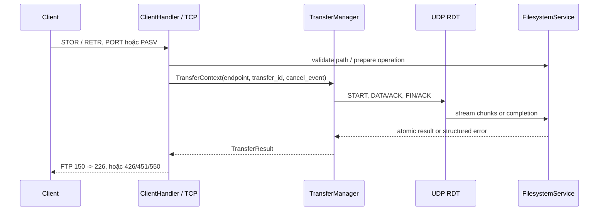

# 3. System Architecture

**Trạng thái:** Hoàn thành phần Role C; chờ A/B review contract/diagram.
**Owner:** C. **Reviewer:** A/B.
**Nguồn:** `../../api-contract.md`, `../../project-status.md`, code và evidence final-week.

Mỗi TCP connection được phục vụ bằng một `ClientHandler` thread với session,
working directory và transfer state riêng. `FTPServer` giữ active-session
registry có lock; khi dừng, server snapshot registry, nhả lock, rồi cleanup và
join handler để tránh deadlock lúc handler unregister chính nó.

`FilesystemService` là filesystem boundary duy nhất. `TransferContext` là
handoff contract giữa command/session, transfer manager và RDT. Go-Back-N giữ
tối đa bốn packet in-flight; ACK tích lũy và timeout retransmit từ window base.
Global client lock không bao giờ bị giữ trong khi chờ UDP ACK.

| Concern | Thiết kế Role C |
|---|---|
| Cleanup | ABOR/disconnect truyền `cancel_event`; `.part` bị xóa, file cũ giữ nguyên |
| Concurrency | Session riêng, per-path lock; transfer không liên quan chạy song song |
| LAN | `--host` bind listener; `--advertise-host` công bố PASV endpoint đúng |
| Observability | Log IP, command đã redact, reply, session/transfer ID, bytes và result |

**Evidence:** protocol 27 pass, fault/transfer/E2E 22 pass, full regression 199
pass; LAN PASV/ACTIVE hai máy có log và SHA-256 khớp trong `../../evidence/`.
