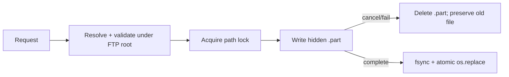

# 6. Filesystem Security

**Trạng thái:** Hoàn thành phần Role C; chờ A review command integration.
**Owner:** C. **Reviewer:** A.
**Nguồn:** `../../api-contract.md`, `../../requirement-checklist.md`, `common/filesystem_service.py`.

`FilesystemService` là entry point duy nhất cho filesystem. Mọi path từ client
được resolve từ FTP root/current working directory, canonicalize bằng real path
và kiểm tra vẫn nằm trong FTP root. Cơ chế này chặn `..`, prefix collision và
symlink escape trước khi đọc, ghi, rename hoặc delete.

| Operation | Bảo đảm |
|---|---|
| STOR | Ghi binary vào hidden `.part`, flush/fsync rồi `os.replace` atomically |
| APPE | Giữ per-path lock khi copy file cũ và append, tránh byte interleave |
| STOU | Chọn UUID-based unused name dưới directory lock |
| RETR | Chỉ stream path đã validate; total bytes đưa vào RDT START cho progress |
| ABOR/disconnect | Hủy write, xóa `.part`, giữ target cũ và trả structured failure |

`FilesystemOperationError` map rõ: `501` invalid parameter, `550` unsafe hoặc
unavailable path, `451` local filesystem error và `426` cancelled transfer.
Role C không mở TCP data connection thứ hai: endpoint Active/PASV được nhận qua
transfer contract do A/B chốt.

**Evidence:** filesystem/transfer/RDT/E2E focused audit `135 passed in 86.22s`;
ABOR/disconnect và hash end-to-end nằm trong
`../../evidence/final-week-rdt-gbn-verification.md`.
