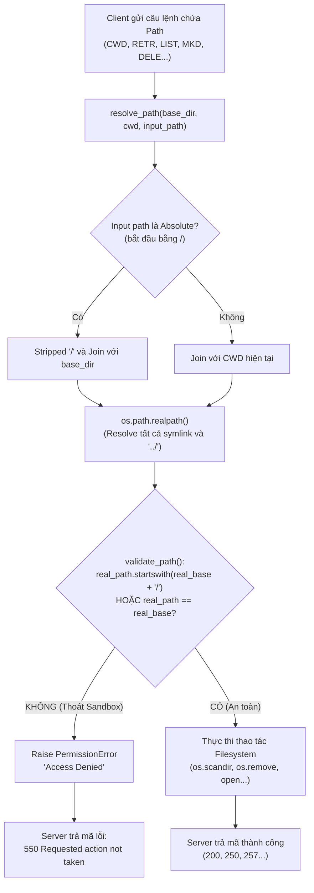

# Technical Report — Hybrid FTP

> Khung theo đúng 7 mục bắt buộc (Section 2.4 đề bài). Ai code phần nào tự điền phần đó.

## 1. Application Scenario & Protocol Interaction
_(Sequence diagram toàn bộ lifecycle TCP + UDP — A vẽ khung TCP, B bổ sung nhánh UDP, C kiểm tra khớp thực tế)_

## 2. Project-Wide Data Structures
_(Control packet format — A | RDTHeader byte-level — B | Session structure — A)_

## 3. Functional Workflows (Flowcharts)

### 3.1 Thread-Dispatch Workflow (Role C)

Mô hình xử lý đa luồng (Multi-threaded Server Architecture) phía Server giúp phục vụ nhiều client kết nối đồng thời mà không bị nghẽn (non-blocking giữa các phiên client).

#### Mô tả chi tiết luồng Thread-Dispatch:
1. **Luồng chính (Main Thread):** 
   - Lắng nghe kết nối TCP trên cổng mặc định (2121).
   - Thiết lập `socket.settimeout(0.5)` để định kỳ unblock hàm `accept()`, cho phép Server rà soát cờ dừng `is_running` để thực hiện *Graceful Shutdown*.
   - Khi có kết nối mới, khởi tạo một instance `ClientHandler` (kế thừa `threading.Thread`) và gọi `.start()` để đẩy công việc xử lý sang luồng mới.
2. **Luồng phụ (Client Thread):**
   - Mỗi Client có 1 thread riêng quản lý trạng thái kết nối độc lập.
   - Khi ngắt kết nối hoặc gửi lệnh `QUIT`, socket client sẽ được đóng an toàn thông qua `shutdown(socket.SHUT_RDWR)` và gỡ khỏi danh sách `active_clients` bằng `threading.Lock()` để đảm bảo an toàn đa luồng (Thread-safety).

---

### 3.2 Path Validation & Security Sandbox Workflow (Role C)

Quy trình ngăn chặn lỗ hổng bảo mật **Path Traversal Attack** (ví dụ: client cố tình gửi lệnh `CWD ../../etc/passwd` để đọc file hệ thống bên ngoài thư mục root của FTP).

#### Mô tả chi tiết cơ chế bảo mật Sandbox:
1. **Khử đường dẫn (Path Normalization):** Sử dụng `os.path.realpath()` để giải mã tất cả các ký tự di chuyển `..`, `.` cũng như resolve các đường dẫn tắt (Symbolic Links).
2. **Kiểm tra ranh giới (Boundary Enforcement):** So sánh chuỗi đường dẫn sau khi resolve xem có bắt đầu bằng `real_base + os.sep` hay không. Việc thêm ký tự phân cách `os.sep` (`/` hoặc `\`) giúp tránh lỗi so sánh chuỗi sai lệch giữa `/ftp_root` và `/ftp_root_backup`.
3. **Phản hồi chuẩn FTP:** Nếu đường dẫn nằm ngoài sandbox, hệ thống từ chối truy cập và phản hồi mã chuẩn FTP `550 Requested action not taken`.

---

### 3.3 RDT Sender/Receiver State Machines (Role B)
_(Sẽ được cập nhật bởi Role B)_

### 3.4 Active/Passive Mode Toggle Workflow (Role C & Role A)
_(Sẽ được cập nhật khi tích hợp Tuần 2)_

## 4. Task Assignment Matrix
_(Xem `phan-chia-cong-viec.md`, C tổng hợp bảng cuối)_

## 5. Self-Assessment & Peer Evaluation
_(Mỗi người tự viết, tổng % = 100%)_

## 6. GenAI Usage & Code Refinement Log
_(Xem `docs/genai-log-a.md`, `docs/genai-log-b.md`, `docs/genai-log-c.md` — mỗi người tự log)_

## 7. Application Demo Evidence
_(Screenshot/log upload, download, hash, session table, concurrent test — C tổng hợp)_

# Technical Report — Hybrid FTP

Role A — TCP Control & Session Management

## 1. Application Scenario & Protocol Interaction

Trong tuần đầu tiên, Role A chịu trách nhiệm xây dựng TCP Control Channel của hệ thống Hybrid FTP. Đây là kênh điều khiển giữa Client và Server, có nhiệm vụ tiếp nhận các lệnh FTP, thực hiện xác thực người dùng, quản lý trạng thái phiên làm việc (Session) và trả về các FTP Reply Code theo đúng đặc tả giao thức.

Khi Client thiết lập kết nối TCP thành công, Server sẽ gửi thông điệp chào 220 Hybrid FTP Server Ready. Tiếp theo, Client thực hiện xác thực bằng hai lệnh USER và PASS. Sau khi đăng nhập thành công, Client được phép thực hiện các lệnh điều khiển như NOOP, PWD, LIST, MKD, CWD, RMD, DELE và kết thúc phiên làm việc bằng QUIT.

Luồng giao tiếp được thiết kế theo mô hình request-response, trong đó mỗi lệnh từ Client đều được Server phân tích, xử lý và phản hồi bằng FTP Reply Code tương ứng.

## 2. Project-Wide Data Structures
### 2.1 FTP Control Command Format

Role A sử dụng định dạng FTP Control Message dưới dạng chuỗi ký tự theo chuẩn:

COMMAND argument

Trong đó:

COMMAND là tên lệnh FTP.
argument là tham số của lệnh (nếu có).

Ví dụ:

USER admin
PASS 123456
CWD test
MKD demo

Sau khi nhận dữ liệu từ TCP Socket, Server sử dụng hàm parse_command() để tách chuỗi thành hai thành phần là Command và Argument trước khi chuyển đến bộ xử lý lệnh.

### 2.2 Session Structure

Để quản lý trạng thái của từng Client, hệ thống xây dựng lớp Session. Mỗi Client khi kết nối tới Server sẽ được cấp phát một Session riêng nhằm lưu trữ trạng thái đăng nhập và thư mục làm việc hiện tại.

class Session:
    def __init__(self):
        self.username = None
        self.is_logged_in = False
        self.current_dir = os.getcwd()

Các trường dữ liệu của Session bao gồm:

Thuộc tính	Ý nghĩa
username	Tên tài khoản đã đăng nhập
is_logged_in	Trạng thái xác thực của Client
current_dir	Thư mục làm việc hiện tại

Việc tách Session thành một lớp riêng giúp dễ dàng mở rộng khi tích hợp mô hình đa luồng ở các giai đoạn tiếp theo, trong đó mỗi Client sẽ sở hữu một Session độc lập.

## 3. Functional Workflows
### 3.1 Authentication Workflow (Role A)

Quy trình xác thực đảm bảo chỉ những Client có thông tin đăng nhập hợp lệ mới được phép sử dụng các chức năng của FTP Server. Quá trình xác thực bao gồm hai bước là kiểm tra Username và Password.

Mô tả chi tiết Authentication Workflow
Sau khi thiết lập kết nối TCP thành công, Server gửi mã phản hồi 220 Hybrid FTP Server Ready để thông báo dịch vụ đã sẵn sàng.
Client gửi lệnh USER. Server kiểm tra Username, nếu hợp lệ sẽ lưu Username vào Session và trả về 331 Username OK, need password. Nếu Username không tồn tại, Server trả về 530 Invalid username.
Client tiếp tục gửi lệnh PASS. Nếu chưa thực hiện lệnh USER, Server trả về 503 Login with USER first. Nếu Password không chính xác, Server trả về 530 Login incorrect. Khi Password hợp lệ, Server cập nhật trạng thái Session.is_logged_in = True và trả về 230 Login successful.
Sau khi xác thực thành công, Client được phép thực hiện các lệnh FTP khác. Nếu chưa đăng nhập mà gửi lệnh yêu cầu quyền truy cập, Server sẽ trả về 530 Not logged in.
### 3.2 FTP Command Processing Workflow (Role A)

Sau khi Client đăng nhập thành công, Server tiếp nhận các FTP Command thông qua TCP Control Channel. Mỗi lệnh được phân tích bằng hàm parse_command(), sau đó chuyển đến bộ xử lý tương ứng và phản hồi bằng FTP Reply Code.

Mô tả chi tiết FTP Command Processing
Server nhận dữ liệu từ TCP Socket thông qua hàm recv().
Chuỗi dữ liệu được truyền vào parse_command() để tách thành tên lệnh và tham số.
Trước khi thực hiện lệnh, Server kiểm tra trạng thái Session.is_logged_in. Nếu Client chưa xác thực, Server từ chối yêu cầu bằng mã 530 Not logged in.
Khi Client đã đăng nhập, Server sử dụng cấu trúc điều kiện (if-elif) để phân phối lệnh đến đoạn mã xử lý tương ứng.
Sau khi hoàn thành xử lý, Server gửi FTP Reply Code phản ánh kết quả thực hiện của lệnh. Đối với các lệnh chưa được hỗ trợ, Server trả về 502 Command not implemented.
## 4. Task Assignment Matrix
Ngày	Công việc
26/07	Xây dựng TCP Server (bind, listen, accept), TCP Client (connect), thống nhất định dạng Control Message
27/07	Xây dựng parser lệnh, triển khai USER và PASS theo FTP Reply Code
28/07	Triển khai QUIT, NOOP và Session Object
29/07	Kiểm thử Authentication Flow và các trường hợp lỗi
30/07	Thiết kế Sequence Diagram cho TCP Control Flow
31/07	Rà soát, sửa lỗi sau review và tối ưu mã nguồn
01/08	Demo toàn bộ TCP Control Flow cho các thành viên trong nhóm
## 5. Self-Assessment

Role A đã hoàn thành việc xây dựng TCP Control Channel, triển khai cơ chế xác thực người dùng, quản lý Session và xử lý các FTP Command cơ bản theo đúng kế hoạch của tuần đầu. Các FTP Reply Code được cài đặt theo đúng đặc tả của đề bài và đã được kiểm thử với nhiều trường hợp hợp lệ cũng như không hợp lệ nhằm đảm bảo Server không bị lỗi hoặc dừng đột ngột khi nhận dữ liệu đầu vào bất thường.

## 6. GenAI Usage & Code Refinement Log

Trong quá trình phát triển, GenAI được sử dụng để tham khảo tài liệu về FTP Reply Code, cơ chế Thread-per-Client, cách tổ chức Session Object và kiểm tra tính hợp lý của luồng xử lý xác thực. Sau khi tham khảo, toàn bộ mã nguồn được chỉnh sửa và tích hợp lại để phù hợp với kiến trúc chung của dự án.

## 7. Application Demo Evidence

Quá trình kiểm thử được thực hiện bằng cách khởi động FTP Server và sử dụng Netcat (nc) để đóng vai trò FTP Client.

Luồng kiểm thử bao gồm:

Thiết lập kết nối TCP.
Đăng nhập bằng USER/PASS.
Kiểm tra các trường hợp sai Username, sai Password và gửi PASS trước USER.
Thực hiện các lệnh NOOP, PWD, LIST, MKD, CWD.
Kết thúc phiên làm việc bằng QUIT.

Kết quả cho thấy toàn bộ FTP Reply Code được trả về đúng theo đặc tả, Server hoạt động ổn định và không xảy ra lỗi trong suốt quá trình kiểm thử.
