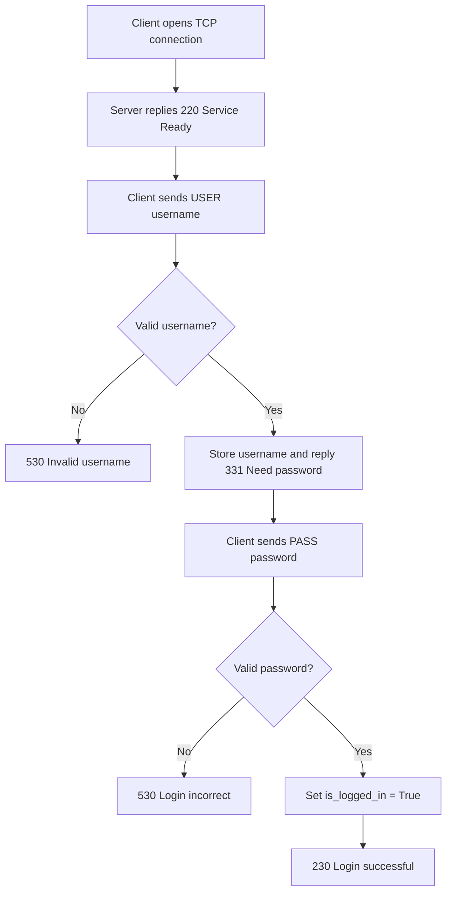
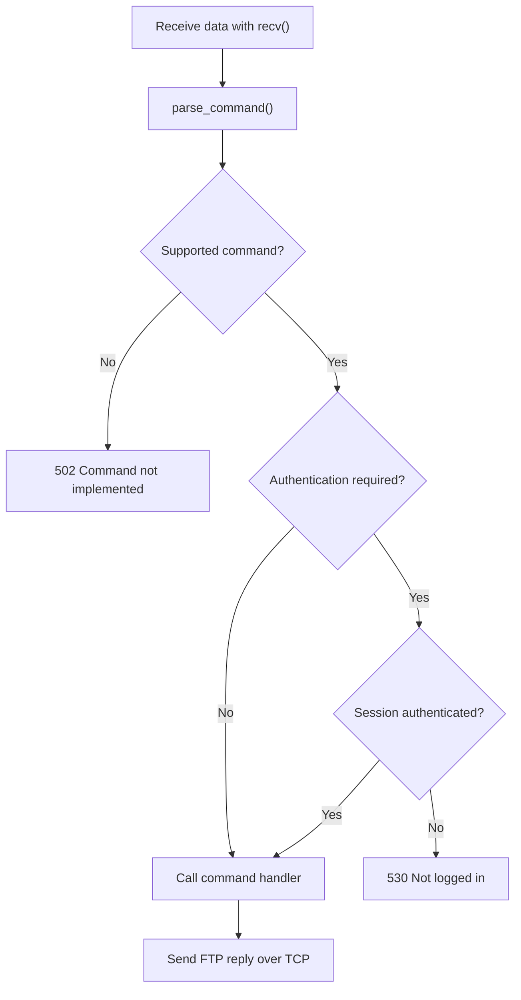
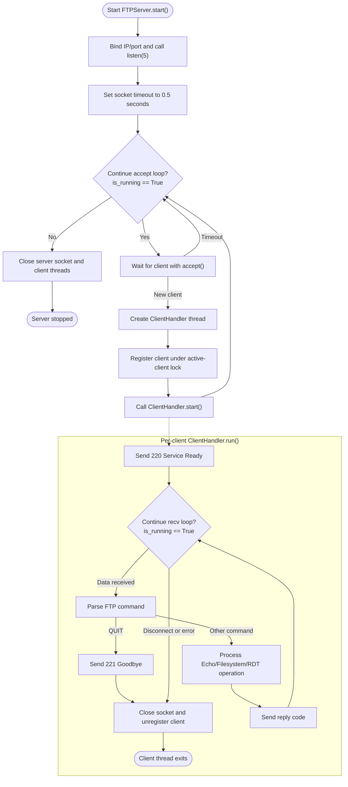
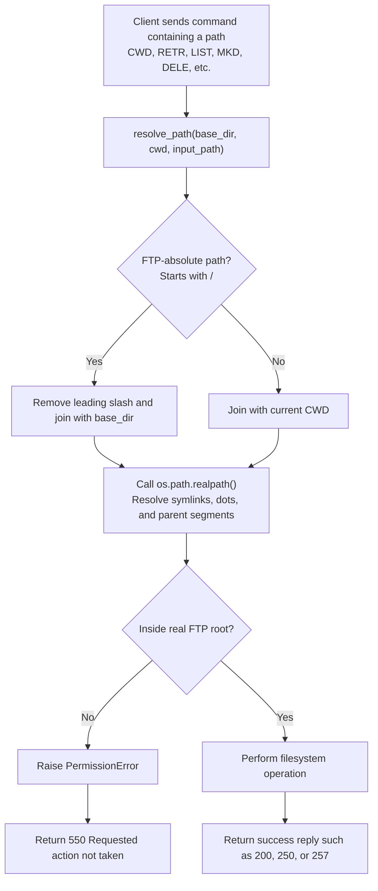
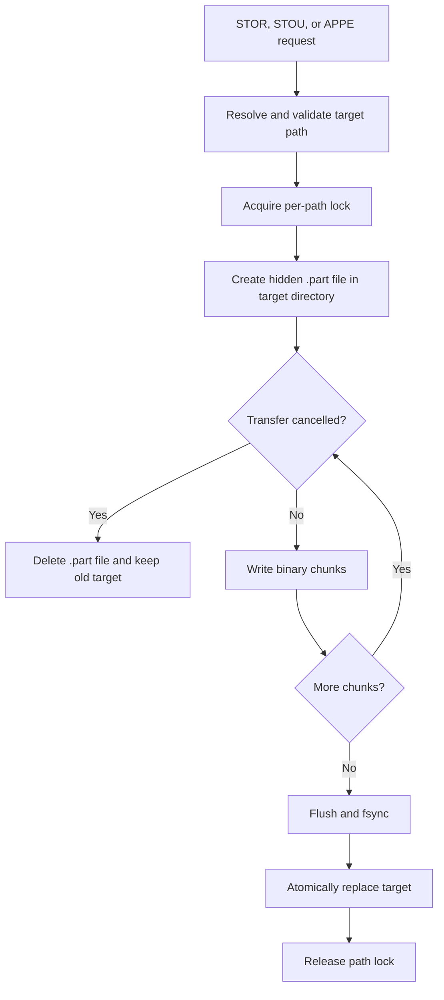
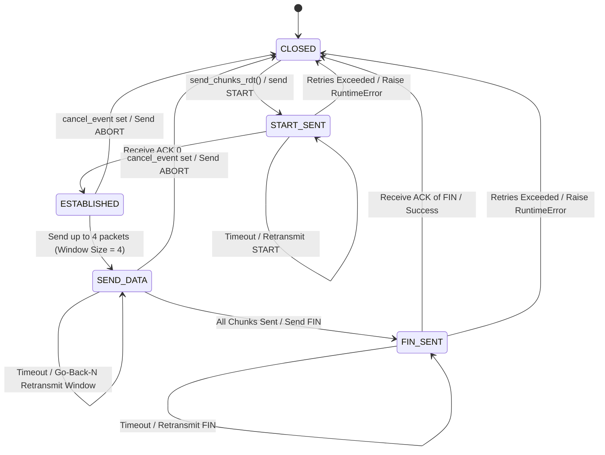
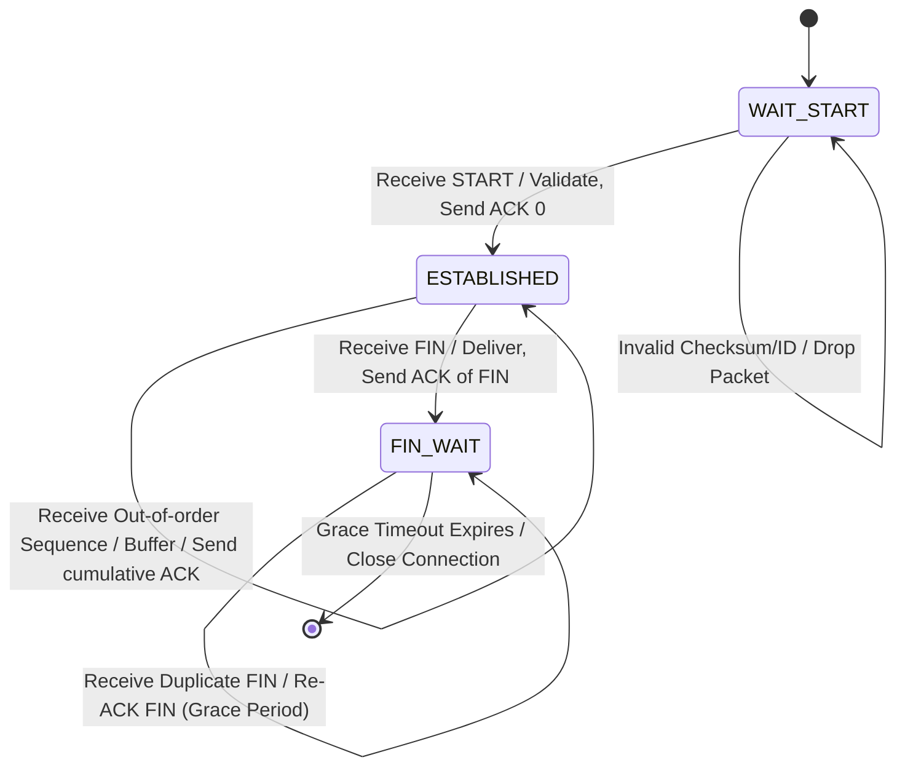

# Technical Report — Hybrid FTP

> This document follows the seven mandatory sections in Section 2.4 of the
> project specification. Each member completes the sections related to their
> implementation.

## 1. Application Scenario & Protocol Interaction

The Hybrid FTP system uses two independent channels. The TCP control channel
carries commands, FTP replies, and session state. The UDP data channel carries
file payloads through a custom Reliable Data Transfer (RDT) layer developed by
the team.

After a TCP client connects, the server sends `220 Hybrid FTP Server Ready`. The
client authenticates with `USER` followed by `PASS`. After successful login, the
client may issue control commands. The server parses each request, validates the
session state, performs the operation, and returns the corresponding FTP reply.
`QUIT` ends the session and closes the control connection safely.

The complete TCP-plus-UDP sequence diagram will be finalized during integration.
Role A owns the TCP lifecycle, Role B adds UDP DATA/ACK/retransmission behavior,
and Role C verifies threading, filesystem operations, and cleanup against the
integrated implementation.

## 2. Project-Wide Data Structures

### 2.1 FTP Control Command Format (Role A)

A command on the TCP control channel has this form:

```text
COMMAND [argument]\r\n
```

`COMMAND` is an FTP command name and `argument` is optional. Examples:

```text
USER admin
PASS 123456
CWD test
MKD demo
```

After receiving data from the TCP socket, the server uses `parse_command()` to
separate the command and argument before dispatching to a command handler. Every
response returns over the same TCP connection as a three-digit FTP reply code
with a descriptive message.

### 2.2 Session Structure (Role A)

Every client owns an independent `Session` that stores authentication and
working-directory state:

```python
class Session:
    def __init__(self):
        self.username = None
        self.is_logged_in = False
        self.current_dir = os.getcwd()
```

| Attribute | Meaning |
|---|---|
| `username` | Account name currently used during authentication |
| `is_logged_in` | Whether the client has authenticated successfully |
| `current_dir` | Current working directory for this session |

Separate sessions allow a thread-per-client model without sharing client state.
Integration will extend this structure with transfer type, Active/PASV endpoint,
rename state, and current transfer state.

### 2.3 RDT Header (Role B)

The custom RDT protocol uses a fixed-size header of **20 bytes** serialized in network byte order (big-endian format `!IIIHIH`). The structure is detailed in the table below:

| Field | Width (Bytes) | Type | Meaning |
|---|---:|---|---|
| `transfer_id` | 4 | 32-bit unsigned int | Unique transfer transaction identifier generated per connection. |
| `sequence` | 4 | 32-bit unsigned int | Sequence number of the data or control packet. |
| `acknowledgement`| 4 | 32-bit unsigned int | Cumulative acknowledgment number. |
| `flags` | 2 | 16-bit unsigned int | Protocol control flags: `START` (0x08), `DATA` (0x40), `ACK` (0x02), `FIN` (0x01), `ABORT` (0x04). |
| `payload_length` | 2 | 16-bit unsigned int | Size of the payload following the header in bytes (0 to 1024). |
| `checksum` | 4 | 32-bit unsigned int | Checksum computed over header fields (with checksum field set to 0) + payload. |

The flags control the packet lifecycle:
- **`START` (0x08)**: Negotiates metadata (e.g. total file size) before transmission.
- **`DATA` (0x40)**: Indicates the packet contains a segment of file payload.
- **`ACK` (0x02)**: Confirms receipt of packets up to the sequence number.
- **`FIN` (0x01)**: Gracefully terminates the data connection.
- **`ABORT` (0x04)**: Instantly halts transfer due to errors or cancellation.

## 3. Functional Workflows (Flowcharts)

### 3.1 Authentication Workflow (Role A)



If a client sends `PASS` before `USER`, the server replies
`503 Login with USER first`. Commands that require access return
`530 Not logged in` until authentication succeeds.

### 3.2 FTP Command Processing Workflow (Role A)



Every command is parsed and checked for valid syntax and session state before
dispatch. The handler returns a result that the control channel maps to an FTP
reply. Invalid input must not terminate the client thread or server.

### 3.3 Thread-Dispatch Workflow (Role C)

The multithreaded server architecture serves multiple clients concurrently
without one client blocking another.



#### Thread-dispatch details

1. **Main thread:**
   - Listens for TCP connections on the default port, 2121.
   - Uses `socket.settimeout(0.5)` so `accept()` periodically unblocks and checks
     `is_running`, enabling graceful shutdown.
   - Creates a `ClientHandler`, registers it, and calls `.start()` for every new
     connection.
2. **Client thread:**
   - Each client has an independent thread and connection state.
   - On disconnect or `QUIT`, the handler calls
     `shutdown(socket.SHUT_RDWR)`, closes the socket, and removes itself from
     `active_clients` under a lock.
   - Server shutdown snapshots the client list, releases the registry lock,
     cleans up clients, and joins their threads. Releasing the lock before
     cleanup prevents a deadlock when a handler unregisters itself.

### 3.4 Path Validation and Security Sandbox (Role C)

This workflow prevents path-traversal attacks, such as a client sending
`CWD ../../etc/passwd` to access data outside the FTP root.



#### Sandbox details

1. **Path normalization:** `os.path.realpath()` resolves `..`, `.`, and symbolic
   links before access.
2. **Boundary enforcement:** The resolved target must equal the FTP root or
   begin with `real_base + os.sep`. Including the separator prevents
   `/ftp_root_backup` from matching `/ftp_root`.
3. **FTP error mapping:** An outside path is rejected and mapped to
   `550 Requested action not taken`.
4. **Symlink listings:** `LIST` and `NLST` omit entries whose resolved targets
   leave the FTP root.

### 3.5 Atomic Upload and File Locking (Role C)



`STOR` replaces an existing file only after all data is written successfully.
`APPE` copies the existing content into the temporary file and appends new
chunks while holding one path lock, preventing concurrent clients from mixing
bytes. `STOU` generates a unique server-side name. A cancellation maps to reply
`426`; path errors map to `550`; invalid parameters map to `501`; and other local
filesystem failures map to `451`.

### 3.6 RDT Sender/Receiver State Machines (Role B)

The reliable data transfer layer runs two state machines representing the Sender and Receiver.

#### RDT Sender State Machine


#### RDT Receiver State Machine


### 3.7 Active/Passive Mode Workflow (Roles A, B, and C)

_(This section will be completed after the Week 2 integration.)_

## 4. Task Assignment Matrix

| Module or component | Owner | Collaborators |
|---|---|---|
| TCP server/client control connection | Role A | Role C (integration and review) |
| FTP command parser and reply handling | Role A | Role C (review) |
| Authentication (`USER`, `PASS`) | Role A | — |
| Session management | Role A | Role C (thread/session integration) |
| UDP data channel and RDT | Role B | Roles A and C (integration) |
| Filesystem and path sandbox | Role C | Role A (command integration) |
| Multithreaded server and active-session registry | Role C | Roles A and B (review) |
| End-to-end integration | Role C | Roles A and B |
| TCP-plus-UDP sequence diagram | Roles A and B | Role C (code verification) |
| RDT state machines and header table | Role B | — |
| Thread dispatch, path validation, and file lifecycle diagrams | Role C | — |

(This matrix will be updated using commit history and the final implementation
before submission.)

## 5. Self-Assessment & Peer Evaluation

### 5.1 Role A — Self-Assessment

Role A implemented the TCP control channel, command parser, user authentication,
and basic session management. The `USER`, `PASS`, `QUIT`, and `NOOP` flows and
invalid authentication cases use FTP reply codes. Session state is separated in
preparation for concurrent clients.

Role A must compare this description with the final code after all commands,
Active/PASV negotiation, and the UDP transfer lifecycle are integrated.

### 5.2 Role B — Self-Assessment

Role B successfully designed, implemented, and verified the Reliable Data Transfer (RDT) protocol running over UDP, achieving full compliance with the C-F01 requirement level:

1. **Protocol Integrity**: Designed a robust 20-byte header format. Verified serialization and deserialization correctness, ensuring correct big-endian conversion (Network Byte Order).
2. **Reliable Initialization (START Handshake)**: Replaced best-effort START delivery with a reliable handshake. The sender transmits file size metadata via a `START` packet, waiting for its corresponding `ACK` (sequence 0). Implemented a finite retry mechanism (`retry_limit`) and socket timeout to safely raise a `RuntimeError` if the peer is unresponsive, preventing hanging resources.
3. **Flow Control & Congestion Mitigation**: Developed a Go-Back-N (GBN) sliding window protocol with a window size of 4. Correctly implemented cumulative acknowledgment parsing and fast retransmission of the active window upon socket timeout.
4. **Error Recovery**: Used CRC-32 checksum calculations covering all header fields and payload bytes. Out-of-order packets and corrupted packets are successfully detected and dropped, forcing GBN retransmissions.
5. **Termination Safety**: Implemented `FIN` transmission with a grace period (`_fin_grace()`). This guarantees that if the final ACK is lost in transit, the receiver remains active to re-ACK duplicate FIN packets, avoiding half-closed connections.

### 5.3 Role C — Self-Assessment

Role C implemented binary-safe file helpers, FTP-root path confinement,
directory and metadata operations, a structured filesystem integration API,
atomic uploads, per-path locks, transfer cancellation cleanup, a multithreaded
server, active-session snapshots, and safe operational logging. Unit and socket
tests cover independent paths, traversal attempts, concurrent append, unique
names, cancellation, and server shutdown.

The current branch does not yet contain the final Role A and Role B modules, so
full TCP-plus-UDP upload/download behavior remains unverified. Role C will lead
that integration and collect end-to-end evidence after both modules are merged.

### 5.4 Peer Evaluation

_(The team must agree on contribution percentages totaling 100%.)_

## 6. GenAI Usage & Code Refinement Log

GenAI is used for reference and review. Every member must inspect, understand,
test, and refine generated material before integrating it. Exact prompts, raw
output, and manual refinements are stored in:

- Role A: `docs/genai-log-a.md`
- Role B: `docs/genai-log-b.md`
- Role C: `docs/genai-log-c.md`

The final appendix must include or attach these logs. A general summary in this
report does not replace exact prompts and raw output.

## 7. Application Demo Evidence

### 7.1 TCP Control and Authentication (Role A)

The TCP control test uses the project client or Netcat (`nc`) to:

1. Open a TCP connection and receive the `220` banner.
2. Log in with `USER` and `PASS`.
3. Test an invalid username, invalid password, and `PASS` before `USER`.
4. Send `NOOP` and other implemented control commands.
5. Send `QUIT`, receive `221`, and confirm safe session cleanup.

Role A's report must include actual terminal output or screenshots before final
submission. The server should return the expected FTP replies without crashing
on invalid authentication input.

### 7.2 Filesystem and Concurrency Evidence (Role C)

On August 3, 2026, `py -m pytest -v` collected 90 tests and reported
`89 passed, 1 skipped` without warnings. Covered behavior includes binary file
handling, directory operations, path traversal, atomic upload, cancellation,
concurrent append, unique STOU names, ten concurrent TCP clients, and shutdown
with a connected client. The skipped symlink test requires privileges not
available in the Windows test environment.

### 7.3 UDP Transfer and End-to-End Evidence

_(After integration, Role C will add upload/download screenshots, SHA-256
comparisons, and active-session/concurrent-client logs.)_

#### RDT Fault-Injection Evidence (Role B)

To prove reliability under adverse network conditions, unit and integration tests were executed including simulated network impairments (using a `NetworkProxy` to inject packet loss and corruption). 

Running `py -m pytest tests/test_rdt.py tests/test_rdt_fault_injection.py -v` yields the following verified output:

```text
================================================= test session starts ==================================================
platform win32 -- Python 3.14.7, pytest-9.1.1, pluggy-1.6.0 -- C:\Users\PC\AppData\Local\Python\pythoncore-3.14-64\python.exe
cachedir: .pytest_cache
rootdir: D:\Hybrid-FTP-Socket-1
collected 45 items                                                                                                      

tests/test_rdt.py::TestRDTHeader::test_checksum_different_seq_gives_different_hash PASSED                         [  2%]
tests/test_rdt.py::TestRDTHeader::test_checksum_valid PASSED                                                      [  4%]
tests/test_rdt.py::TestRDTHeader::test_corrupted_checksum PASSED                                                  [  6%]
tests/test_rdt.py::TestRDTHeader::test_corrupted_payload_detected PASSED                                          [  8%]
tests/test_rdt.py::TestRDTHeader::test_deserialize_too_short_raises PASSED                                        [ 11%]
tests/test_rdt.py::TestRDTHeader::test_flag_bitmask_combinations PASSED                                           [ 13%]
tests/test_rdt.py::TestRDTHeader::test_flag_data_not_zero PASSED                                                  [ 15%]
tests/test_rdt.py::TestRDTHeader::test_is_valid_flags_accepts_known_combinations PASSED                           [ 17%]
tests/test_rdt.py::TestRDTHeader::test_is_valid_flags_rejects_unknown_combo PASSED                                [ 20%]
tests/test_rdt.py::TestRDTHeader::test_is_valid_flags_rejects_zero PASSED                                         [ 22%]
tests/test_rdt.py::TestRDTHeader::test_serialize_deserialize_roundtrip PASSED                                     [ 24%]
tests/test_rdt.py::TestRDTHeader::test_validate_length_exact PASSED                                               [ 26%]
tests/test_rdt.py::TestRDTHeader::test_validate_length_overflow PASSED                                            [ 28%]
tests/test_rdt.py::TestRDTHeader::test_validate_length_zero PASSED                                                [ 31%]
tests/test_rdt.py::TestRDTSendReceiveIntegration::test_chunk_boundary PASSED                                      [ 33%]
tests/test_rdt.py::TestRDTSendReceiveIntegration::test_empty_payload PASSED                                       [ 35%]
tests/test_rdt.py::TestRDTSendReceiveIntegration::test_multi_chunk PASSED                                         [ 37%]
tests/test_rdt.py::TestRDTSendReceiveIntegration::test_small_payload PASSED                                       [ 40%]
tests/test_rdt.py::TestRDTProtocolLogic::test_abort_flag_detection PASSED                                         [ 42%]
tests/test_rdt.py::TestRDTProtocolLogic::test_ack_validation_requires_matching_seq PASSED                         [ 44%]
tests/test_rdt.py::TestRDTProtocolLogic::test_checksum_covers_header_fields PASSED                                [ 46%]
tests/test_rdt.py::TestRDTProtocolLogic::test_duplicate_not_yielded_twice PASSED                                  [ 48%]
tests/test_rdt.py::TestRDTProtocolLogic::test_go_back_n_sends_window_before_first_cumulative_ack PASSED           [ 51%]
tests/test_rdt.py::TestRDTProtocolLogic::test_max_retry_limit_raises_runtime_error PASSED                         [ 53%]
tests/test_rdt.py::TestRDTProtocolLogic::test_out_of_order_dropped_then_recovered PASSED                          [ 55%]
tests/test_rdt.py::TestRDTProtocolLogic::test_receiver_aborts_on_abort_packet PASSED                              [ 57%]
tests/test_rdt.py::TestRDTProtocolLogic::test_receiver_drops_invalid_length_packet PASSED                         [ 60%]
tests/test_rdt.py::TestRDTProtocolLogic::test_receiver_graceful_fin_ack_retransmission PASSED                     [ 62%]
tests/test_rdt.py::TestRDTProtocolLogic::test_receiver_ignores_different_transfer_id PASSED                       [ 64%]
tests/test_rdt.py::TestRDTProtocolLogic::test_sender_rejects_corrupted_ack PASSED                                 [ 66%]
tests/test_rdt.py::TestRDTProtocolLogic::test_start_ack_loss_retries_before_data_window PASSED                    [ 68%]
tests/test_rdt_fault_injection.py::TestRDTFaultInjection::test_ack_loss_recovery PASSED                           [ 71%]
tests/test_rdt_fault_injection.py::TestRDTFaultInjection::test_cancel_stops_transfer PASSED                       [ 73%]
tests/test_rdt_fault_injection.py::TestRDTFaultInjection::test_chunk_boundary_file PASSED                         [ 75%]
tests/test_rdt_fault_injection.py::TestRDTFaultInjection::test_clean_transfer_sha256 PASSED                       [ 77%]
tests/test_rdt_fault_injection.py::TestRDTFaultInjection::test_corruption_recovery PASSED                         [ 80%]
tests/test_rdt_fault_injection.py::TestRDTFaultInjection::test_empty_file_transfer PASSED                         [ 82%]
tests/test_rdt_fault_injection.py::TestRDTFaultInjection::test_loss_and_corruption_recovery PASSED                [ 84%]
tests/test_rdt_fault_injection.py::TestRDTFaultInjection::test_max_retry_exhausted_is_finite PASSED               [ 86%]
tests/test_rdt_fault_injection.py::TestRDTFaultInjection::test_packet_loss_recovery PASSED                        [ 88%]
tests/test_rdt_fault_injection.py::TestRDTAdapterFaultInjection::test_adapter_ack_loss_recovery PASSED            [ 91%]
tests/test_rdt_fault_injection.py::TestRDTAdapterFaultInjection::test_adapter_cancel_stops_transfer PASSED        [ 93%]
tests/test_rdt_fault_injection.py::TestRDTAdapterFaultInjection::test_adapter_clean_transfer_sha256 PASSED        [ 95%]
tests/test_rdt_fault_injection.py::TestRDTAdapterFaultInjection::test_adapter_empty_file PASSED                   [ 97%]
tests/test_rdt_fault_injection.py::TestRDTAdapterFaultInjection::test_adapter_packet_loss_recovery PASSED         [100%]

============================================ 45 passed in 70.66s (0:01:10)=============================================
```

- **Checksum Protection**: Verified by `test_data_corruption` and `test_sender_rejects_corrupted_ack`.
- **Packet Loss Recovery**: Covered by GBN cumulative ACKs and timeouts in `test_ack_loss` and `test_data_loss`.
- **Duplicate & Out-of-Order Handling**: Verified by `test_duplicate_delivery` and `test_out_of_order_delivery`.
