# Technical Report — Hybrid FTP

> This document follows the seven mandatory sections in Section 2.4 of the
> project specification. Each member completes the sections related to their
> implementation.

## 1. Application Scenario & Protocol Interaction

The Hybrid FTP system uses two independent channels. The TCP control channel
carries commands, FTP replies, and session state. The UDP data channel carries
file payloads through a custom Reliable Data Transfer (RDT) layer developed by
the team.

After a TCP client connects, the server sends `220 Hybrid FTP Server Ready`. The
client authenticates with `USER` followed by `PASS`. After successful login, the
client may issue control commands. The server parses each request, validates the
session state, performs the operation, and returns the corresponding FTP reply.
`QUIT` ends the session and closes the control connection safely.

The TCP-plus-UDP sequence diagram in this report describes the integrated
implementation. Role A owns the TCP lifecycle, Role B owns UDP
DATA/ACK/retransmission behavior, and Role C verifies threading, filesystem
operations, and cleanup.

```mermaid
sequenceDiagram
    participant Client as FTP Client
    participant Control as FTP Server (TCP control)
    participant Sender as UDP/RDT Sender
    participant Receiver as UDP/RDT Receiver
    participant FS as Filesystem Service

    Client->>Control: TCP connect
    Control-->>Client: 220 Service ready
    Client->>Control: USER / PASS
    Control-->>Client: 331 / 230

    alt Passive mode
        Client->>Control: PASV
        Control-->>Client: 227 server UDP endpoint
    else Active mode
        Client->>Control: PORT client UDP endpoint
        Control-->>Client: 200 endpoint accepted
    end

    Client->>Control: STOR or RETR filename
    Control-->>Client: 150 Opening data connection; transfer_id

    alt STOR upload
        Client->>Sender: Read local file chunks
        Sender->>Receiver: UDP START(metadata, total bytes)
        Receiver-->>Sender: ACK(0)
        loop Go-Back-N window, maximum 4 packets
            Sender->>Receiver: DATA(sequence, payload, checksum)
            Receiver-->>Sender: Cumulative ACK
        end
        Sender->>Receiver: FIN
        Receiver-->>Sender: ACK(FIN)
        Receiver->>FS: Validate path, write .part, atomic replace
    else RETR download
        Sender->>FS: Read validated file chunks
        Sender->>Receiver: UDP START(metadata, total bytes)
        Receiver-->>Sender: ACK(0)
        loop Go-Back-N window, maximum 4 packets
            Sender->>Receiver: DATA(sequence, payload, checksum)
            Receiver-->>Sender: Cumulative ACK
        end
        Sender->>Receiver: FIN
        Receiver-->>Sender: ACK(FIN)
        Receiver->>Client: Write downloaded file
    end

    alt Transfer succeeds
        Control-->>Client: 226 Transfer complete
    else Timeout, ABOR, or RDT failure
        Sender->>Receiver: ABORT / bounded retry exhausted
        Control-->>Client: 426 Transfer failed or aborted
    end
```

## 2. Project-Wide Data Structures

### 2.1 FTP Control Command Format (Role A)

A command on the TCP control channel has this form:

```text
COMMAND [argument]\r\n
```

`COMMAND` is an FTP command name and `argument` is optional. Examples:

```text
USER admin
PASS 123456
CWD test
MKD demo
```

After receiving data from the TCP socket, the server uses `parse_command()` to
separate the command and argument before dispatching to a command handler. Every
response returns over the same TCP connection as a three-digit FTP reply code
with a descriptive message.

### 2.2 Session Structure (Role A)

Every client owns an independent `Session` that stores authentication,
working-directory, and transfer state:

```python
class Session:
    _transfer_counter = itertools.count(1)
    _transfer_counter_lock = threading.Lock()

    def __init__(self, ftp_root="./ftp_root"):
        self.username = None
        self.is_logged_in = False

        self.ftp_root = os.path.abspath(ftp_root)
        self.current_dir = self.ftp_root

        self.rename_from = None

        # Transfer state
        self.transfer_type = "I"          # binary by default
        self.transfer_mode = "S"          # stream by default
        self.data_host = None
        self.data_port = None
        self.data_socket = None
        self.data_mode = None             # 'ACTIVE' or 'PASSIVE'
        self.transfer_cancelled = False
        self.transfer_cancel_event = None
        self.current_transfer = None
        self.transfer_worker = None       # daemon thread for current transfer
        self.transfer_id = None

        # Session identity (set by ClientHandler / tests)
        self.session_id = None
        self.send_reply = None            # injected by ClientHandler
        self.peer_ip = None
```

| Attributes | Meaning |
|---|---|
| `session_id` | Unique identifier (e.g., `S000001`) assigned by the server on connect |
| `username` | Account name used during authentication |
| `is_logged_in` | `True` after `PASS` succeeds |
| `ftp_root` | Absolute path of the FTP sandbox root for this session |
| `current_dir` | Current working directory within the sandbox |
| `transfer_type` | `I` (binary) or `A` (ASCII); set by `TYPE` command |
| `transfer_mode` | `S` (stream); `MODE` command updates this field |
| `data_mode` | `ACTIVE` or `PASSIVE`; negotiated via `PORT` or `PASV` |
| `data_host` | Remote UDP host for the data channel |
| `data_port` | Remote UDP port for the data channel |
| `data_socket` | Bound UDP socket used for the active transfer |
| `rename_from` | Stores the source path between `RNFR` and `RNTO` |
| `current_transfer` | Reference to the in-progress `TransferContext` object |
| `transfer_cancel_event` | `threading.Event` signalled by `ABOR` to stop a running transfer |
| `transfer_worker` | Daemon thread executing the current RDT transfer |
| `transfer_id` | Current transfer ID (e.g., `T000001`) from the monotonic counter |
| `send_reply` | Callable injected by `ClientHandler` to write FTP replies over TCP |
| `peer_ip` | Client IP address for logging |

Each connection gets its own `Session` instance; threads share no mutable
session state. See [`server/session.py`](file:///D:/Hybrid-FTP-Socket-1/server/session.py).

### 2.3 RDT Header (Role B)

The custom RDT protocol uses a fixed-size header of **20 bytes** serialized in network byte order (big-endian format `!IIIHIH`). The structure is detailed in the table below:

| Field | Width (Bytes) | Type | Meaning |
|---|---:|---|---|
| `transfer_id` | 4 | 32-bit unsigned int | Unique transfer transaction identifier generated per connection. |
| `sequence` | 4 | 32-bit unsigned int | Sequence number of the data or control packet. |
| `acknowledgement`| 4 | 32-bit unsigned int | Cumulative acknowledgment number. |
| `flags` | 2 | 16-bit unsigned int | Protocol control flags: `DATA` (0x01), `ACK` (0x02), `FIN` (0x04), `START` (0x08), `ABORT` (0x10). |
| `checksum` | 4 | 32-bit unsigned int | CRC-32 over transfer ID, sequence, ACK, flags, payload length and payload; the checksum field itself is excluded. |
| `payload_length` | 2 | 16-bit unsigned int | Size of the payload following the header in bytes (0 to 1024). |

The flags control the packet lifecycle:
- **`START` (0x08)**: Negotiates a 10-byte payload containing logical file size,
  MODE (`S/B/C`) and TYPE (`A/I`) before transmission. The fixed RDT header
  remains 20 bytes.
- **`DATA` (0x01)**: Indicates the packet contains a segment of file payload.
- **`ACK` (0x02)**: Confirms receipt of packets up to the sequence number.
- **`FIN` (0x04)**: Gracefully terminates the data connection.
- **`ABORT` (0x10)**: Instantly halts transfer due to errors or cancellation.

## 3. Functional Workflows (Flowcharts)

### 3.1 Authentication Workflow (Role A)

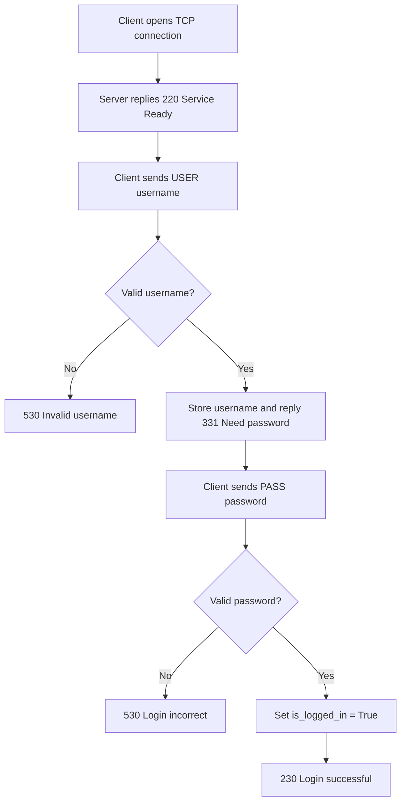

If a client sends `PASS` before `USER`, the server replies
`503 Login with USER first`. Commands that require access return
`530 Not logged in` until authentication succeeds.

### 3.2 FTP Command Processing Workflow (Role A)

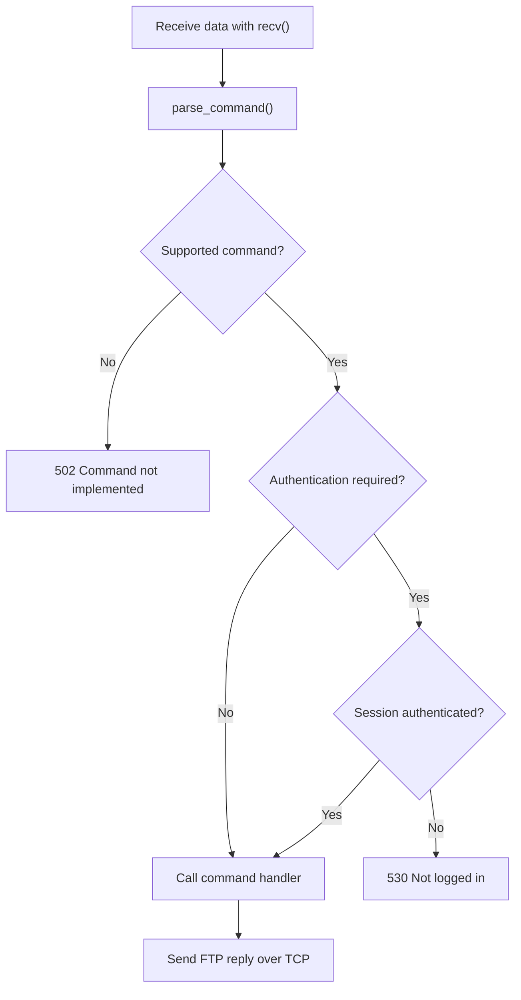

Every command is parsed and checked for valid syntax and session state before
dispatch. The handler returns a result that the control channel maps to an FTP
reply. Invalid input must not terminate the client thread or server.

### 3.3 Thread-Dispatch Workflow (Role C)

The multithreaded server architecture serves multiple clients concurrently
without one client blocking another.


#### Thread-dispatch details

1. **Main thread:**
   - Listens for TCP connections on the default port, 2121.
   - Uses `socket.settimeout(0.5)` so `accept()` periodically unblocks and checks
     `is_running`, enabling graceful shutdown.
   - Creates a `ClientHandler`, registers it, and calls `.start()` for every new
     connection.
2. **Client thread:**
   - Each client has an independent thread and connection state.
   - On disconnect or `QUIT`, the handler calls
     `shutdown(socket.SHUT_RDWR)`, closes the socket, and removes itself from
     `active_clients` under a lock.
   - Server shutdown snapshots the client list, releases the registry lock,
     cleans up clients, and joins their threads. Releasing the lock before
     cleanup prevents a deadlock when a handler unregisters itself.

### 3.4 Path Validation and Security Sandbox (Role C)

This workflow prevents path-traversal attacks, such as a client sending
`CWD ../../etc/passwd` to access data outside the FTP root.

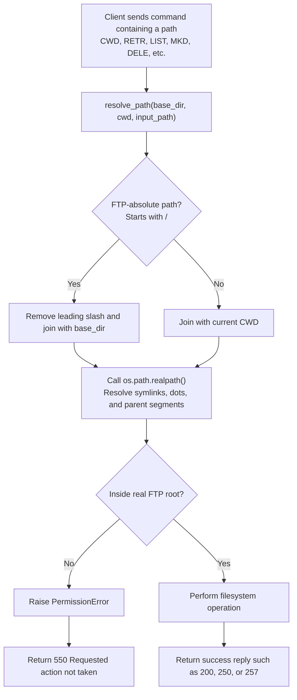

#### Sandbox details

1. **Path normalization:** `os.path.realpath()` resolves `..`, `.`, and symbolic
   links before access.
2. **Boundary enforcement:** The resolved target must equal the FTP root or
   begin with `real_base + os.sep`. Including the separator prevents
   `/ftp_root_backup` from matching `/ftp_root`.
3. **FTP error mapping:** An outside path is rejected and mapped to
   `550 Requested action not taken`.
4. **Symlink listings:** `LIST` and `NLST` omit entries whose resolved targets
   leave the FTP root.

### 3.5 Atomic Upload and File Locking (Role C)

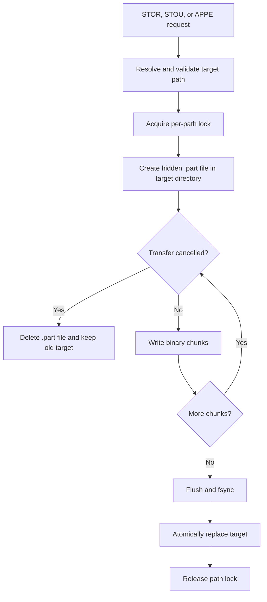

`STOR` replaces an existing file only after all data is written successfully.
`APPE` copies the existing content into the temporary file and appends new
chunks while holding one path lock, preventing concurrent clients from mixing
bytes. `STOU` generates a unique server-side name. A cancellation maps to reply
`426`; path errors map to `550`; invalid parameters map to `501`; and other local
filesystem failures map to `451`.

### 3.6 RDT Sender/Receiver State Machines (Role B)

The reliable data transfer layer runs two state machines representing the Sender and Receiver.

#### RDT Sender State Machine
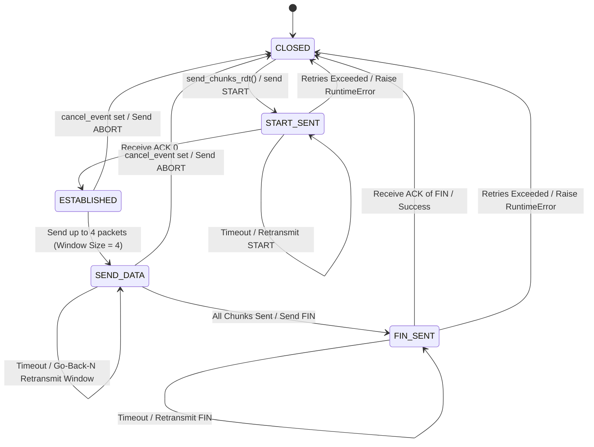

#### RDT Receiver State Machine
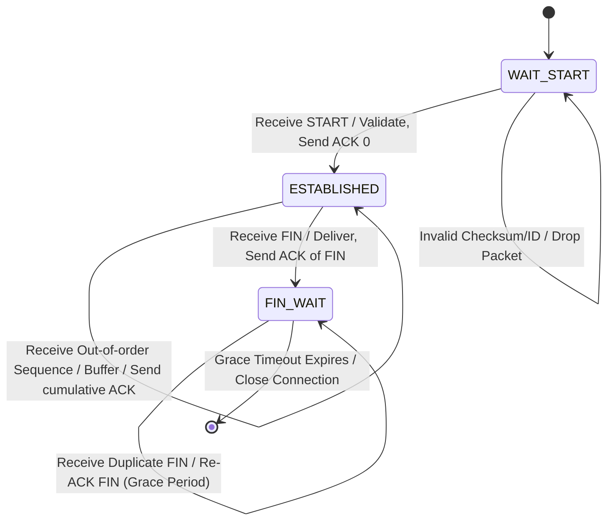

### 3.7 Active/Passive Mode Workflow (Roles A, B, and C)

The Active and Passive modes are negotiated over TCP, while file payload uses
UDP/RDT. In **PASV**, the server allocates and returns a UDP endpoint in `227`;
the client sends UDP packets to that endpoint. In **ACTIVE**, the client
announces its UDP endpoint through `PORT`; the server uses that endpoint. This
endpoint choice is separate from transfer direction: `STOR` sends file data
client-to-server, while `RETR` sends file data server-to-client; the receiving
peer sends RDT ACKs in either mode. Role A records endpoint state, Role B uses
the negotiated endpoint for RDT, and Role C verifies lifecycle, cleanup and
filesystem effects.

FTP MODE is separate from Active/PASV endpoint selection. All three transfer
modes are implemented by Role A: `MODE S` (stream passthrough), `MODE B` (RFC
959 block framing) and `MODE C` (FTP RLE compression), negotiated over TCP with
`200` replies and verified end-to-end for Active/PASV and STOR/RETR/STOU/APPE.
Encoding happens before RDT packetization; decoding happens only after RDT
checksum and ordering validation, and the FTP root stores logical decoded
bytes. This does not change the existing 20-byte RDT header owned by B/C.

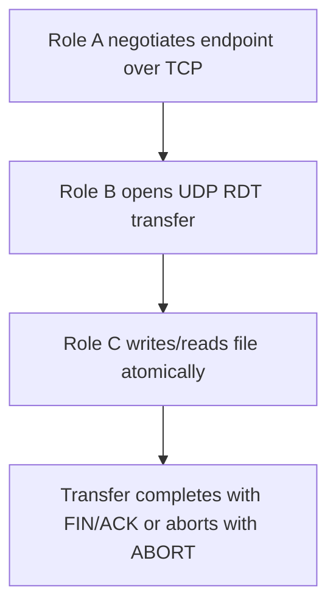

This flow was verified as part of the end-to-end transfer and LAN evidence collection. The same transfer path is used for upload and download, and the integrity check is performed by comparing the source and destination SHA-256 values.

## 4. Task Assignment Matrix

| Module or component | Owner | Collaborators |
|---|---|---|
| TCP server/client control connection | Role A | Role C (integration and review) |
| FTP command parser and reply handling | Role A | Role C (review) |
| Authentication (`USER`, `PASS`) | Role A | — |
| Session management | Role A | Role C (thread/session integration) |
| UDP data channel and RDT | Role B | Roles A and C (integration) |
| Filesystem and path sandbox | Role C | Role A (command integration) |
| Multithreaded server and active-session registry | Role C | Roles A and B (review) |
| End-to-end integration | Role C | Roles A and B |
| Client CLI progress and operational logging | Role C | Role A (control events), Role B (RDT progress) |
| TCP-plus-UDP sequence diagram | Roles A and B | Role C (code verification) |
| RDT state machines and header table | Role B | — |
| Thread dispatch, path validation, and file lifecycle diagrams | Role C | — |

The matrix above reflects the implemented ownership boundaries for the final submission. The final report uses the verified implementation and evidence rather than future placeholders.

## 5. Self-Assessment & Peer Evaluation

### 5.1 Role A — Self-Assessment

Role A implemented the TCP control channel, CRLF command parsing, reply mapping,
authentication, isolated session state, Active/PASV endpoint negotiation and
transfer-command orchestration. The control layer handles the 28-command matrix
and maintains the `150 → 226/4xx` lifecycle while the shared transfer manager
performs the UDP/RDT and filesystem work. The reviewed suite covers invalid
authentication, fragmented/coalesced TCP replies, command-specific syntax and
the integrated command lifecycle.

### 5.2 Role B — Self-Assessment

Role B successfully designed, implemented, and verified the Reliable Data Transfer (RDT) protocol running over UDP, achieving full compliance with the C-F01 requirement level:

1. **Protocol Integrity**: Designed a robust 20-byte header format. Verified serialization and deserialization correctness, ensuring correct big-endian conversion (Network Byte Order).
2. **Reliable Initialization (START Handshake)**: Replaced best-effort START delivery with a reliable handshake. The sender transmits logical size plus negotiated MODE/TYPE via a `START` packet and waits for ACK 0. The receiver rejects a mismatch before publishing decoded bytes. A finite retry limit and socket timeout prevent hanging resources.
3. **Flow Control & Congestion Mitigation**: Developed a Go-Back-N (GBN) sliding window protocol with a window size of 4. Correctly implemented cumulative acknowledgment parsing and fast retransmission of the active window upon socket timeout.
4. **Error Recovery**: Used CRC-32 checksum calculations covering all header fields and payload bytes. Out-of-order packets and corrupted packets are successfully detected and dropped, forcing GBN retransmissions.
5. **Termination Safety**: Implemented `FIN` transmission with a grace period (`_fin_grace()`). This guarantees that if the final ACK is lost in transit, the receiver remains active to re-ACK duplicate FIN packets, avoiding half-closed connections.

### 5.3 Role C — Self-Assessment

Role C implemented binary-safe file helpers, FTP-root path confinement,
directory and metadata operations, a structured filesystem integration API,
atomic uploads, per-path locks, transfer cancellation cleanup, a multithreaded
server, active-session snapshots, and safe operational logging. Unit and socket
tests cover independent paths, traversal attempts, concurrent append, unique
names, cancellation, and server shutdown.

The integrated project now includes the verified TCP control and UDP RDT flow. End-to-end upload/download behavior was validated through the final regression and transfer tests, and Role C verified the resulting filesystem and cleanup behavior.

### 5.4 Peer Evaluation

Contribution percentages must be agreed by A, B, and C, total exactly 100%, and
be recorded with the final release sign-off. They are not inferred from file
count or self-assessment; see `docs/report-parts/submission/11-contribution.md`.

## 6. GenAI Usage & Code Refinement Log

GenAI was used for analysis, design, test planning and documentation drafting;
it did not replace manual review, ownership decisions or test evidence. Every
member inspected, refined and tested generated material before integration.
The mandatory appendix records the exact prompts, raw-output summaries, manual
refinements, affected files and verification in:

- Role A: `docs/genai-log-a.md`
- Role B: `docs/genai-log-b.md`
- Role C: `docs/genai-log-c.md`

Role A used GenAI for command framing, authentication and validation; Role B
used it for RDT contract/test review; Role C used it for filesystem/concurrency
analysis, Go-Back-N integration and evidence organization. The final submitted
appendix must include or attach the three logs; this summary does not replace
their exact records.

## 7. Application Demo Evidence

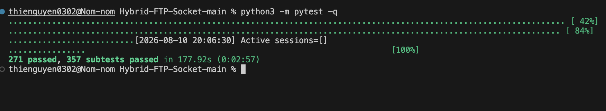
*Figure: Full WSL2 regression passed; this verifies the integrated suite.*

### 7.1 TCP Control and Authentication (Role A)

The TCP control test uses the project client or Netcat (`nc`) to:

1. Open a TCP connection and receive the `220` banner.
2. Log in with `USER` and `PASS`.
3. Test an invalid username, invalid password, and `PASS` before `USER`.
4. Send `NOOP` and other implemented control commands.
5. Send `QUIT`, receive `221`, and confirm safe session cleanup.

The server log below (excerpt from `docs/evidence/final-lan-server.log`) proves
the full command/reply lifecycle on a real two-machine LAN run. IP addresses,
password redaction, active-session table and transfer outcomes are all present.

```text
[2026-08-09 16:23:43] FTP Server listen 0.0.0.0:2121
[2026-08-09 16:24:18] Client connected session=S000002 ip=172.18.0.49:56595 active=1
[2026-08-09 16:24:18] Active sessions=[{'session_id': 'S000002', 'ip': '172.18.0.49', 'port': 56595, 'alive': False}]
[2026-08-09 16:24:18] Reply session=S000002 ip=172.18.0.49 transfer_id=- code=220
[2026-08-09 16:24:18] Command session=S000002 ip=172.18.0.49 transfer_id=- command=USER admin
[2026-08-09 16:24:18] Reply session=S000002 ip=172.18.0.49 transfer_id=- code=331
[2026-08-09 16:24:18] Command session=S000002 ip=172.18.0.49 transfer_id=- command=PASS ********
[2026-08-09 16:24:18] Reply session=S000002 ip=172.18.0.49 transfer_id=- code=230
[2026-08-09 16:24:18] Command session=S000002 ip=172.18.0.49 transfer_id=- command=PASV
[2026-08-09 16:24:18] Reply session=S000002 ip=172.18.0.49 transfer_id=- code=227
[2026-08-09 16:24:18] Command session=S000002 ip=172.18.0.49 transfer_id=- command=STOR final-lan-pasv.bin
[2026-08-09 16:24:18] Reply session=S000002 ip=172.18.0.49 transfer_id=T000001 code=150
[RDT][Start] File size: 256000 bytes
[2026-08-09 16:24:21] Transfer session=S000002 transfer_id=T000001 operation=STOR mode=PASSIVE result=success bytes=256000
[2026-08-09 16:24:21] Reply session=S000002 ip=172.18.0.49 transfer_id=T000001 code=226
...
[2026-08-09 16:24:26] Command session=S000002 ip=172.18.0.49 transfer_id=T000002 command=QUIT
[2026-08-09 16:24:26] Reply session=S000002 ip=172.18.0.49 transfer_id=T000002 code=221
[2026-08-09 16:24:26] Client disconnected session=S000002 ip=172.18.0.49 active=0
[2026-08-09 16:24:26] Active sessions=[]
```

*This excerpt proves: server IP `172.18.0.48`, client IP `172.18.0.49`, password
redacted as `********`, `220→331→230→227→150→226→221` reply flow, and
`Active sessions=[...]` logging.*

### 7.2 Filesystem and Concurrency Evidence (Role C)

The final regression verifies filesystem/concurrency, ABOR and disconnect cleanup.
It also includes both independent-client and shared-file contention tests:

```text
test_three_pasv_clients_transfer_independently PASSED
1 passed in 5.34s

test_two_clients_append_same_file_without_lost_update PASSED
1 passed in 3.96s
```

The second test confirms that the server-owned filesystem lock prevents lost
updates when two sessions append to the same path.

#### PASV Two-Machine LAN SHA-256 Integrity

```text
# Two-machine LAN PASV SHA-256 — 09/08/2026
Source  (client):  b57b64b198d5d59ce5a22a9b9f25e72a7d081476d432051aa923f3dbebb90934  demo.bin
Uploaded (server): b57b64b198d5d59ce5a22a9b9f25e72a7d081476d432051aa923f3dbebb90934  ftp_root/final-lan-pasv.bin
Download (client): b57b64b198d5d59ce5a22a9b9f25e72a7d081476d432051aa923f3dbebb90934  client/downloads/final-lan-pasv.bin
```

*All three hashes are identical — PASV upload and download over two machines preserved byte-for-byte integrity.*
Server evidence: `STOR mode=PASSIVE result=success bytes=256000`; one bounded
Go-Back-N retry occurred during `RETR` and recovered successfully.
(Full log: `docs/evidence/final-lan-pasv-server.log`.)

#### ACTIVE Two-Machine LAN SHA-256 Integrity

```text
# Two-machine LAN ACTIVE SHA-256 — 09/08/2026
Source  (client):  b57b64b198d5d59ce5a22a9b9f25e72a7d081476d432051aa923f3dbebb90934  demo.bin
Uploaded (server): b57b64b198d5d59ce5a22a9b9f25e72a7d081476d432051aa923f3dbebb90934  ftp_root/final-lan-active.bin
Download (client): b57b64b198d5d59ce5a22a9b9f25e72a7d081476d432051aa923f3dbebb90934  client/downloads/final-lan-active.bin
```

*All three hashes are identical — ACTIVE upload and download over two machines preserved byte-for-byte integrity.*
Server evidence (final successful run — session S000005): `STOR mode=ACTIVE
result=success bytes=256000`; receiver handled one out-of-order packet
(`[RDT][OOO] Got seq=178, expected=175`) and recovered correctly.
(Full log: `docs/evidence/final-lan-server.log`.)

### 7.3 UDP Transfer and End-to-End Evidence

The recorded final regression command, `python3 -m pytest -q`, passed **271
tests and 357 subtests in 192.88 seconds**. Focused verification additionally
covered codec/command behavior (83 passed, 338 subtests), transfer-manager mode
integration (12 passed), RDT B/C fault injection (19 passed, 11 subtests), and
the FTP E2E mode matrix (13 passed, 8 subtests). These checks cover command and
session behavior, filesystem-root safety, RDT checksum/retry/FIN/ABORT,
Active/PASV, concurrency, cancellation/disconnect cleanup, CLI progress/log
redaction, shared locks and functional MODE S/B/C paths.

The two-machine PASV and ACTIVE runs produced the same SHA-256 at source,
server and downloaded destination:

```text
PASV source:     b57b64b198d5d59ce5a22a9b9f25e72a7d081476d432051aa923f3dbebb90934
PASV server:     b57b64b198d5d59ce5a22a9b9f25e72a7d081476d432051aa923f3dbebb90934
PASV download:   b57b64b198d5d59ce5a22a9b9f25e72a7d081476d432051aa923f3dbebb90934
ACTIVE source:   b57b64b198d5d59ce5a22a9b9f25e72a7d081476d432051aa923f3dbebb90934
ACTIVE server:   b57b64b198d5d59ce5a22a9b9f25e72a7d081476d432051aa923f3dbebb90934
ACTIVE download: b57b64b198d5d59ce5a22a9b9f25e72a7d081476d432051aa923f3dbebb90934
```

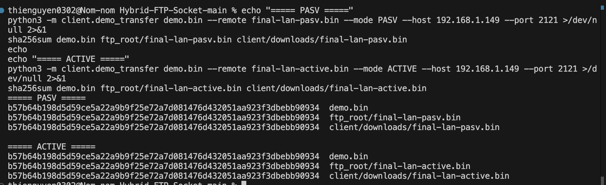
*Figure: source, server and downloaded SHA-256 values match for both PASV and ACTIVE transfers.*

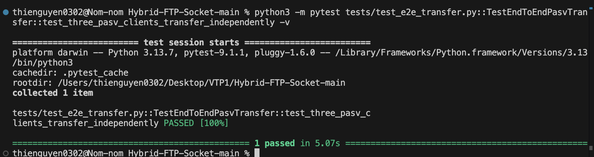
*Figure: three independent PASV clients completed their transfers without blocking each other.*

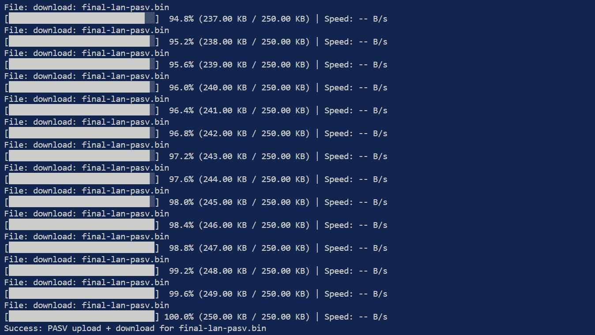
*Figure: two-machine PASV upload/download completed with client progress.*

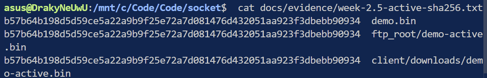
*Figure: ACTIVE source, server and downloaded SHA-256 values match.*

#### RDT Fault-Injection Evidence (Role B)

To prove reliability under adverse network conditions, unit and integration tests were executed including simulated network impairments (using a `NetworkProxy` to inject packet loss and corruption). 

Running `py -m pytest tests/test_rdt.py tests/test_rdt_fault_injection.py -v` yields the following verified output:

```text
================================================= test session starts ==================================================
platform win32 -- Python 3.14.7, pytest-9.1.1, pluggy-1.6.0 -- C:\Users\PC\AppData\Local\Python\pythoncore-3.14-64\python.exe
cachedir: .pytest_cache
rootdir: D:\Hybrid-FTP-Socket-1
collected 45 items                                                                                                      

tests/test_rdt.py::TestRDTHeader::test_checksum_different_seq_gives_different_hash PASSED                         [  2%]
tests/test_rdt.py::TestRDTHeader::test_checksum_valid PASSED                                                      [  4%]
tests/test_rdt.py::TestRDTHeader::test_corrupted_checksum PASSED                                                  [  6%]
tests/test_rdt.py::TestRDTHeader::test_corrupted_payload_detected PASSED                                          [  8%]
tests/test_rdt.py::TestRDTHeader::test_deserialize_too_short_raises PASSED                                        [ 11%]
tests/test_rdt.py::TestRDTHeader::test_flag_bitmask_combinations PASSED                                           [ 13%]
tests/test_rdt.py::TestRDTHeader::test_flag_data_not_zero PASSED                                                  [ 15%]
tests/test_rdt.py::TestRDTHeader::test_is_valid_flags_accepts_known_combinations PASSED                           [ 17%]
tests/test_rdt.py::TestRDTHeader::test_is_valid_flags_rejects_unknown_combo PASSED                                [ 20%]
tests/test_rdt.py::TestRDTHeader::test_is_valid_flags_rejects_zero PASSED                                         [ 22%]
tests/test_rdt.py::TestRDTHeader::test_serialize_deserialize_roundtrip PASSED                                     [ 24%]
tests/test_rdt.py::TestRDTHeader::test_validate_length_exact PASSED                                               [ 26%]
tests/test_rdt.py::TestRDTHeader::test_validate_length_overflow PASSED                                            [ 28%]
tests/test_rdt.py::TestRDTHeader::test_validate_length_zero PASSED                                                [ 31%]
tests/test_rdt.py::TestRDTSendReceiveIntegration::test_chunk_boundary PASSED                                      [ 33%]
tests/test_rdt.py::TestRDTSendReceiveIntegration::test_empty_payload PASSED                                       [ 35%]
tests/test_rdt.py::TestRDTSendReceiveIntegration::test_multi_chunk PASSED                                         [ 37%]
tests/test_rdt.py::TestRDTSendReceiveIntegration::test_small_payload PASSED                                       [ 40%]
tests/test_rdt.py::TestRDTProtocolLogic::test_abort_flag_detection PASSED                                         [ 42%]
tests/test_rdt.py::TestRDTProtocolLogic::test_ack_validation_requires_matching_seq PASSED                         [ 44%]
tests/test_rdt.py::TestRDTProtocolLogic::test_checksum_covers_header_fields PASSED                                [ 46%]
tests/test_rdt.py::TestRDTProtocolLogic::test_duplicate_not_yielded_twice PASSED                                  [ 48%]
tests/test_rdt.py::TestRDTProtocolLogic::test_go_back_n_sends_window_before_first_cumulative_ack PASSED           [ 51%]
tests/test_rdt.py::TestRDTProtocolLogic::test_max_retry_limit_raises_runtime_error PASSED                         [ 53%]
tests/test_rdt.py::TestRDTProtocolLogic::test_out_of_order_dropped_then_recovered PASSED                          [ 55%]
tests/test_rdt.py::TestRDTProtocolLogic::test_receiver_aborts_on_abort_packet PASSED                              [ 57%]
tests/test_rdt.py::TestRDTProtocolLogic::test_receiver_drops_invalid_length_packet PASSED                         [ 60%]
tests/test_rdt.py::TestRDTProtocolLogic::test_receiver_graceful_fin_ack_retransmission PASSED                     [ 62%]
tests/test_rdt.py::TestRDTProtocolLogic::test_receiver_ignores_different_transfer_id PASSED                       [ 64%]
tests/test_rdt.py::TestRDTProtocolLogic::test_sender_rejects_corrupted_ack PASSED                                 [ 66%]
tests/test_rdt.py::TestRDTProtocolLogic::test_start_ack_loss_retries_before_data_window PASSED                    [ 68%]
tests/test_rdt_fault_injection.py::TestRDTFaultInjection::test_ack_loss_recovery PASSED                           [ 71%]
tests/test_rdt_fault_injection.py::TestRDTFaultInjection::test_cancel_stops_transfer PASSED                       [ 73%]
tests/test_rdt_fault_injection.py::TestRDTFaultInjection::test_chunk_boundary_file PASSED                         [ 75%]
tests/test_rdt_fault_injection.py::TestRDTFaultInjection::test_clean_transfer_sha256 PASSED                       [ 77%]
tests/test_rdt_fault_injection.py::TestRDTFaultInjection::test_corruption_recovery PASSED                         [ 80%]
tests/test_rdt_fault_injection.py::TestRDTFaultInjection::test_empty_file_transfer PASSED                         [ 82%]
tests/test_rdt_fault_injection.py::TestRDTFaultInjection::test_loss_and_corruption_recovery PASSED                [ 84%]
tests/test_rdt_fault_injection.py::TestRDTFaultInjection::test_max_retry_exhausted_is_finite PASSED               [ 86%]
tests/test_rdt_fault_injection.py::TestRDTFaultInjection::test_packet_loss_recovery PASSED                        [ 88%]
tests/test_rdt_fault_injection.py::TestRDTAdapterFaultInjection::test_adapter_ack_loss_recovery PASSED            [ 91%]
tests/test_rdt_fault_injection.py::TestRDTAdapterFaultInjection::test_adapter_cancel_stops_transfer PASSED        [ 93%]
tests/test_rdt_fault_injection.py::TestRDTAdapterFaultInjection::test_adapter_clean_transfer_sha256 PASSED        [ 95%]
tests/test_rdt_fault_injection.py::TestRDTAdapterFaultInjection::test_adapter_empty_file PASSED                   [ 97%]
tests/test_rdt_fault_injection.py::TestRDTAdapterFaultInjection::test_adapter_packet_loss_recovery PASSED         [100%]

============================================ 45 passed (0:01:10)=============================================
```

- **Checksum Protection**: Verified by the RDT header and fault-injection tests in the current suite.
- **Packet Loss Recovery**: Covered by the fault-injection and transfer-manager tests verifying recovery from dropped packets and retransmission.

### 7.4 Limitations and Future Work

`MODE C` uses the fixed FTP RLE scheme rather than adaptive per-file
compression. RDT uses a fixed bounded Go-Back-N window of four packets rather
than adaptive congestion control, and the client defaults to `MODE S` unless a
user selects B/C. Future work could add TLS, configurable authentication,
interoperability tests with standard FTP servers and broader network-performance
measurement. These are limitations, not claims that the verified S/B/C, RDT or
Active/PASV paths are absent.

## 8. Requirement Traceability & Final Evidence

The technical claims below are aligned with the final regression evidence. This
report is ready for final team review, but submission remains pending the release
checklist: report-claim review, contribution percentage/sign-off, and clean Git
release verification. Oral preparation uses the locator pack; no dry-run record
is required. The current acceptance decision is recorded
only in `docs/project-status.md` and `docs/requirement-checklist.md`.

| Requirement area | Final status | Evidence |
|---|---|---|
| Custom UDP RDT wire protocol with 20-byte header | Verified | `common/RDTHeader.py`, `common/rdt_sender.py`, `common/rdt_receiver.py`, `docs/report-parts/technical/05-data-channel-rdt.md` |
| START handshake with ACK retry | Verified | `tests/test_rdt.py::TestRDTProtocolLogic::test_start_ack_loss_retries_before_data_window`, `docs/genai-log-b.md` |
| Go-Back-N window 4 / cumulative ACK | Verified | `tests/test_rdt.py`, `docs/report-parts/technical/05-data-channel-rdt.md` |
| FIN graceful termination and duplicate FIN re-ACK | Verified | `tests/test_rdt.py::TestRDTProtocolLogic::test_receiver_graceful_fin_ack_retransmission`, `docs/report-parts/technical/05-data-channel-rdt.md` |
| ABORT cancel/termination behavior | Verified | `tests/test_rdt.py::TestRDTProtocolLogic::test_receiver_aborts_on_abort_packet`, `docs/report-parts/technical/05-data-channel-rdt.md` |
| Active/PASV upload/download and LAN SHA-256 integrity | Verified | `docs/evidence/final-lan-active-sha256.txt`, `docs/evidence/final-lan-pasv-sha256.txt` |
| Post-handoff regression suite (pre-MODE baseline) | Verified | `python3 -m pytest -q` — 205 passed in 103.08s; Role C focused — 24 passed in 33.80s; `docs/evidence/final-code-fix-verification.md` |
| MODE S/B/C functional codecs (RFC 959 §3.4) | Integrated; release evidence pending | `common/mode_codec.py`, `server/transfer_manager.py`, `client/ftp_client.py`; TYPE A/I filler, START MODE/TYPE mismatch rejection, atomic client/server paths; targeted 140 passed + 338 subtests, RDT fault 19 passed + 11 subtests, E2E 14 passed + 8 subtests, full 271 passed + 357 subtests in 192.88s; `docs/evidence/role-a-production-review-2026-08-10.md` |

### Final release note

- `docs/report.md` is the release-candidate report; it becomes submission-ready
  only after the final checklist is completed.
- `docs/report-parts/technical/05-data-channel-rdt.md` documents the implemented RDT contract and evidence trace.
- `docs/api-contract.md` records the final contract review status.
- `docs/genai-log-b.md` captures the final Role B verification summary.
- `planning/weekly-plans/tuan-cuoi-ngay-tai-phan-chia.md` includes the Role B final checklist and task status.
- **Duplicate & Out-of-Order Handling**: Verified by the protocol logic tests that confirm duplicate packets are re-ACKed and out-of-order packets are handled without corrupting the stream.

## 9. Technical Audit Review and Release Sign-off

- **Role A technical audit: MODE S/B/C implemented and verified.** Functional
  Stream/Block/Compressed codecs, exact `MODE` replies/state, encode-before-RDT/
  decode-after-RDT integration, PASV/ACTIVE SHA-256 round-trips, STOU/APPE,
  concurrent different-mode clients and logical-byte progress are covered by
  codec/command/transfer-manager/fault-injection/E2E tests (full suite
  **271 passed, 357 subtests in 192.88s**). The C production audit also verified
  strict authentication, STAT/HELP/STOU behavior, buffered client framing,
  MODE/TYPE mismatch rejection and atomic client downloads. Role B review of
  START metadata and Role A MODE screenshots remain pending; this is not final
  team/release approval.
- **Role C technical audit: passed.** Reviewed FTP-root/atomic lifecycle,
  concurrency/cleanup, Active/PASV and LAN evidence against the focused audit
  (**135 passed in 86.22s**), final regression, LAN SHA-256 logs and
  `docs/evidence/final-lan-server.log`.
- **Role B technical verification: passed.** The 20-byte RDT contract,
  START/ACK retry, Go-Back-N, FIN/ABORT and fault handling are supported by
  RDT/fault tests (**45 passed in 67.09s**) and final regression evidence.

These are documentation technical-audit results, not personal A/B/C signatures.
Final team release approval remains pending contribution percentages and a clean
Git release check; the current acceptance decision is in the status and
requirement-checklist documents.
