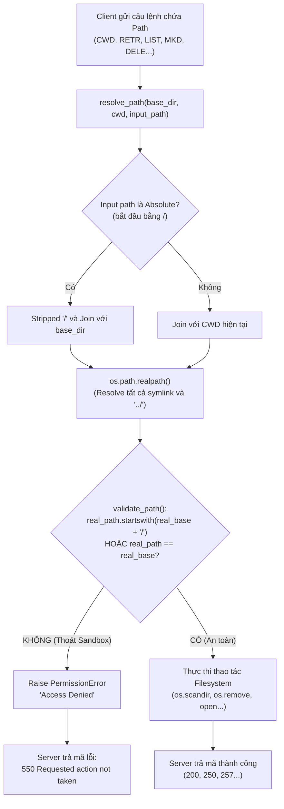

# Technical Report — Hybrid FTP

> Khung theo đúng 7 mục bắt buộc (Section 2.4 đề bài). Ai code phần nào tự điền phần đó.

## 1. Application Scenario & Protocol Interaction
_(Sequence diagram toàn bộ lifecycle TCP + UDP — A vẽ khung TCP, B bổ sung nhánh UDP, C kiểm tra khớp thực tế)_

## 2. Project-Wide Data Structures
_(Control packet format — A | RDTHeader byte-level — B | Session structure — A)_

## 3. Functional Workflows (Flowcharts)

### 3.1 Thread-Dispatch Workflow (Role C)

Mô hình xử lý đa luồng (Multi-threaded Server Architecture) phía Server giúp phục vụ nhiều client kết nối đồng thời mà không bị nghẽn (non-blocking giữa các phiên client).

#### Mô tả chi tiết luồng Thread-Dispatch:
1. **Luồng chính (Main Thread):** 
   - Lắng nghe kết nối TCP trên cổng mặc định (2121).
   - Thiết lập `socket.settimeout(0.5)` để định kỳ unblock hàm `accept()`, cho phép Server rà soát cờ dừng `is_running` để thực hiện *Graceful Shutdown*.
   - Khi có kết nối mới, khởi tạo một instance `ClientHandler` (kế thừa `threading.Thread`) và gọi `.start()` để đẩy công việc xử lý sang luồng mới.
2. **Luồng phụ (Client Thread):**
   - Mỗi Client có 1 thread riêng quản lý trạng thái kết nối độc lập.
   - Khi ngắt kết nối hoặc gửi lệnh `QUIT`, socket client sẽ được đóng an toàn thông qua `shutdown(socket.SHUT_RDWR)` và gỡ khỏi danh sách `active_clients` bằng `threading.Lock()` để đảm bảo an toàn đa luồng (Thread-safety).

---

### 3.2 Path Validation & Security Sandbox Workflow (Role C)

Quy trình ngăn chặn lỗ hổng bảo mật **Path Traversal Attack** (ví dụ: client cố tình gửi lệnh `CWD ../../etc/passwd` để đọc file hệ thống bên ngoài thư mục root của FTP).

#### Mô tả chi tiết cơ chế bảo mật Sandbox:
1. **Khử đường dẫn (Path Normalization):** Sử dụng `os.path.realpath()` để giải mã tất cả các ký tự di chuyển `..`, `.` cũng như resolve các đường dẫn tắt (Symbolic Links).
2. **Kiểm tra ranh giới (Boundary Enforcement):** So sánh chuỗi đường dẫn sau khi resolve xem có bắt đầu bằng `real_base + os.sep` hay không. Việc thêm ký tự phân cách `os.sep` (`/` hoặc `\`) giúp tránh lỗi so sánh chuỗi sai lệch giữa `/ftp_root` và `/ftp_root_backup`.
3. **Phản hồi chuẩn FTP:** Nếu đường dẫn nằm ngoài sandbox, hệ thống từ chối truy cập và phản hồi mã chuẩn FTP `550 Requested action not taken`.

---

### 3.3 RDT Sender/Receiver State Machines (Role B)
_(Sẽ được cập nhật bởi Role B)_

### 3.4 Active/Passive Mode Toggle Workflow (Role C & Role A)
_(Sẽ được cập nhật khi tích hợp Tuần 2)_

## 4. Task Assignment Matrix
_(Xem `phan-chia-cong-viec.md`, C tổng hợp bảng cuối)_

## 5. Self-Assessment & Peer Evaluation
_(Mỗi người tự viết, tổng % = 100%)_

## 6. GenAI Usage & Code Refinement Log
_(Xem `docs/genai-log-a.md`, `docs/genai-log-b.md`, `docs/genai-log-c.md` — mỗi người tự log)_

## 7. Application Demo Evidence
_(Screenshot/log upload, download, hash, session table, concurrent test — C tổng hợp)_
