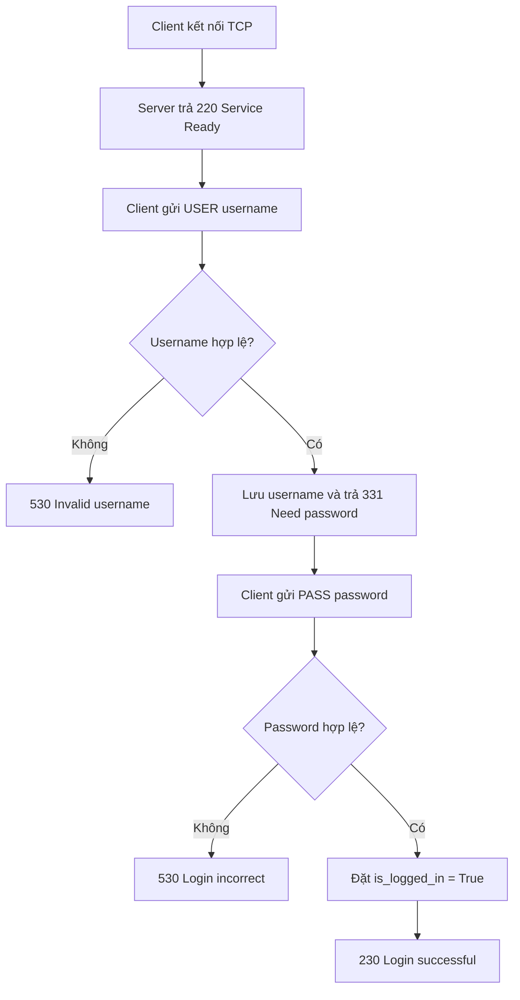
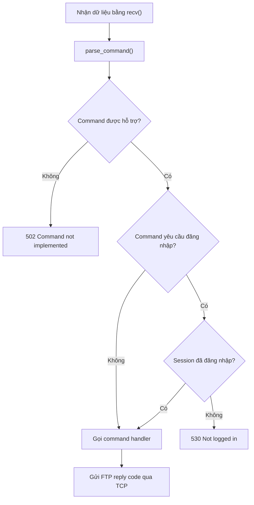
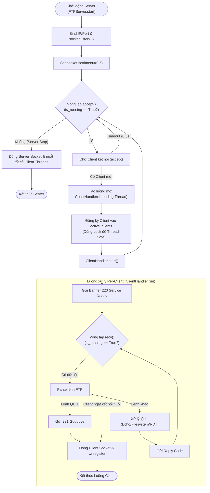
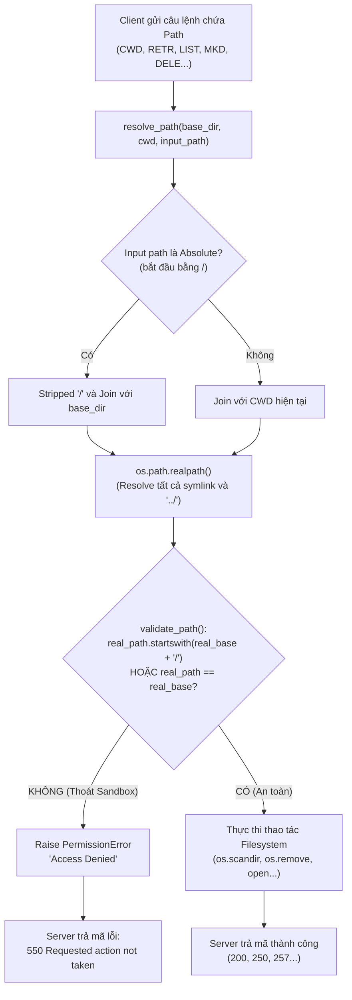

# Technical Report — Hybrid FTP

> Khung theo đúng 7 mục bắt buộc (Section 2.4 đề bài). Ai code phần nào tự điền phần đó.

## 1. Application Scenario & Protocol Interaction

Hệ thống Hybrid FTP tách thành hai kênh độc lập: TCP Control Channel truyền lệnh, FTP reply và trạng thái session; UDP Data Channel truyền payload file thông qua lớp Reliable Data Transfer (RDT) do nhóm tự xây dựng.

Ở phía TCP, sau khi client kết nối thành công, server gửi `220 Hybrid FTP Server Ready`. Client xác thực lần lượt bằng `USER` và `PASS`. Khi đăng nhập thành công, client có thể gửi các lệnh điều khiển; mỗi request được server parse, kiểm tra trạng thái, xử lý và phản hồi bằng FTP reply code tương ứng. `QUIT` kết thúc session và đóng control connection an toàn.

Sequence diagram đầy đủ của lifecycle TCP + UDP sẽ được hoàn thiện khi tích hợp: Role A phụ trách nhánh TCP, Role B bổ sung DATA/ACK/retransmission trên UDP, Role C kiểm tra thread, filesystem và cleanup theo hệ thống thực tế.

## 2. Project-Wide Data Structures

### 2.1 FTP Control Command Format (Role A)

Lệnh trên TCP Control Channel có dạng:

```text
COMMAND [argument]\r\n
```

Trong đó `COMMAND` là tên lệnh FTP và `argument` là tham số tùy chọn. Ví dụ:

```text
USER admin
PASS 123456
CWD test
MKD demo
```

Sau khi nhận dữ liệu từ TCP socket, server dùng `parse_command()` để tách command và argument trước khi chuyển đến command handler. Mọi phản hồi được gửi lại qua cùng TCP connection dưới dạng FTP reply code ba chữ số và nội dung mô tả.

### 2.2 Session Structure (Role A)

Mỗi client sở hữu một `Session` độc lập để lưu trạng thái xác thực và thư mục làm việc:

```python
class Session:
    def __init__(self):
        self.username = None
        self.is_logged_in = False
        self.current_dir = os.getcwd()
```

| Thuộc tính | Ý nghĩa |
|---|---|
| `username` | Tên tài khoản đang thực hiện quá trình đăng nhập |
| `is_logged_in` | Trạng thái xác thực của client |
| `current_dir` | Thư mục làm việc hiện tại của session |

Việc tách session giúp server mở rộng sang mô hình thread-per-client mà không dùng chung trạng thái giữa các client. Cấu trúc này sẽ tiếp tục được mở rộng cho transfer type, Active/PASV endpoint, rename state và transfer state trong giai đoạn tích hợp.

### 2.3 RDT Header (Role B)

_(Role B bổ sung bảng byte-level gồm sequence number, ACK, checksum, flags và payload length.)_

## 3. Functional Workflows (Flowcharts)

### 3.1 Authentication Workflow (Role A)



Nếu client gửi `PASS` trước `USER`, server trả `503 Login with USER first`. Các lệnh yêu cầu quyền truy cập bị từ chối bằng `530 Not logged in` cho đến khi xác thực thành công.

### 3.2 FTP Command Processing Workflow (Role A)



Mỗi command được parse, kiểm tra cú pháp và trạng thái session trước khi chuyển đến handler. Handler trả kết quả để control channel ánh xạ thành FTP reply code; exception đầu vào không được làm dừng client thread hoặc server.

### 3.3 Thread-Dispatch Workflow (Role C)

Mô hình xử lý đa luồng (Multi-threaded Server Architecture) phía Server giúp phục vụ nhiều client kết nối đồng thời mà không bị nghẽn (non-blocking giữa các phiên client).



#### Mô tả chi tiết luồng Thread-Dispatch:
1. **Luồng chính (Main Thread):** 
   - Lắng nghe kết nối TCP trên cổng mặc định (2121).
   - Thiết lập `socket.settimeout(0.5)` để định kỳ unblock hàm `accept()`, cho phép Server rà soát cờ dừng `is_running` để thực hiện *Graceful Shutdown*.
   - Khi có kết nối mới, khởi tạo một instance `ClientHandler` (kế thừa `threading.Thread`) và gọi `.start()` để đẩy công việc xử lý sang luồng mới.
2. **Luồng phụ (Client Thread):**
   - Mỗi Client có 1 thread riêng quản lý trạng thái kết nối độc lập.
   - Khi ngắt kết nối hoặc gửi lệnh `QUIT`, socket client sẽ được đóng an toàn thông qua `shutdown(socket.SHUT_RDWR)` và gỡ khỏi danh sách `active_clients` bằng `threading.Lock()` để đảm bảo an toàn đa luồng (Thread-safety).

---

### 3.4 Path Validation & Security Sandbox Workflow (Role C)

Quy trình ngăn chặn lỗ hổng bảo mật **Path Traversal Attack** (ví dụ: client cố tình gửi lệnh `CWD ../../etc/passwd` để đọc file hệ thống bên ngoài thư mục root của FTP).



#### Mô tả chi tiết cơ chế bảo mật Sandbox:
1. **Khử đường dẫn (Path Normalization):** Sử dụng `os.path.realpath()` để giải mã tất cả các ký tự di chuyển `..`, `.` cũng như resolve các đường dẫn tắt (Symbolic Links).
2. **Kiểm tra ranh giới (Boundary Enforcement):** So sánh chuỗi đường dẫn sau khi resolve xem có bắt đầu bằng `real_base + os.sep` hay không. Việc thêm ký tự phân cách `os.sep` (`/` hoặc `\`) giúp tránh lỗi so sánh chuỗi sai lệch giữa `/ftp_root` và `/ftp_root_backup`.
3. **Phản hồi chuẩn FTP:** Nếu đường dẫn nằm ngoài sandbox, hệ thống từ chối truy cập và phản hồi mã chuẩn FTP `550 Requested action not taken`.

---

### 3.5 RDT Sender/Receiver State Machines (Role B)
_(Sẽ được cập nhật bởi Role B)_

### 3.6 Active/Passive Mode Toggle Workflow (Role C & Role A)
_(Sẽ được cập nhật khi tích hợp Tuần 2)_

## 4. Task Assignment Matrix

| Module/Component | Owner | Collaborators |
|---|---|---|
| TCP server/client control connection | Role A | Role C (integration/review) |
| FTP command parser và reply-code handling | Role A | Role C (review) |
| Authentication (`USER`, `PASS`) | Role A | — |
| Session management | Role A | Role C (thread/session integration) |
| UDP Data Channel và RDT | Role B | Role A, Role C (integration) |
| Filesystem và path sandbox | Role C | Role A (command integration) |
| Multi-threaded server và active-session registry | Role C | Role A, Role B (review) |
| End-to-end integration | Role C | Role A, Role B |
| TCP + UDP sequence diagram | Role A, Role B | Role C (kiểm tra theo code) |
| RDT state machines và header table | Role B | — |
| Thread-dispatch và path-validation flowcharts | Role C | — |

Ma trận sẽ được cập nhật theo commit history và kết quả cuối cùng trước khi nộp báo cáo.

## 5. Self-Assessment & Peer Evaluation

### 5.1 Role A — Self-Assessment

Role A đã xây dựng TCP Control Channel, command parser, cơ chế xác thực người dùng và session cơ bản. Các luồng `USER`/`PASS`, `QUIT`, `NOOP` và các trường hợp xác thực sai đã được xử lý bằng FTP reply code. Cấu trúc session được tách riêng để chuẩn bị cho mô hình nhiều client ở giai đoạn tích hợp.

Role A cần tiếp tục đối chiếu tài liệu với code sau khi tích hợp đầy đủ command, Active/PASV và UDP transfer lifecycle.

### 5.2 Role B — Self-Assessment

_(Role B tự bổ sung đánh giá phần UDP/RDT.)_

### 5.3 Role C — Self-Assessment

_(Role C tự bổ sung đánh giá phần filesystem, concurrency và integration.)_

### 5.4 Peer Evaluation

_(Cả nhóm thống nhất phần trăm đóng góp; tổng phải bằng 100%.)_

## 6. GenAI Usage & Code Refinement Log

GenAI được dùng như công cụ tham khảo và review; mỗi thành viên phải tự kiểm tra, giải thích và refactor kết quả trước khi đưa vào hệ thống. Prompt chính xác, raw output và phần chỉnh sửa thủ công được lưu riêng tại:

- Role A: `docs/genai-log-a.md`.
- Role B: `docs/genai-log-b.md`.
- Role C: `docs/genai-log-c.md`.

Phần phụ lục cuối phải trích hoặc đính kèm đầy đủ các log trên; mô tả tổng quát trong báo cáo không thay thế yêu cầu ghi exact prompt và raw output.

## 7. Application Demo Evidence

### 7.1 TCP Control và Authentication (Role A)

Quy trình kiểm thử TCP Control Channel sử dụng client của dự án hoặc Netcat (`nc`) gồm:

1. Thiết lập TCP connection và nhận banner `220`.
2. Đăng nhập bằng `USER`/`PASS`.
3. Kiểm tra sai username, sai password và gửi `PASS` trước `USER`.
4. Gửi `NOOP` và các command điều khiển đã được triển khai.
5. Gửi `QUIT`, nhận `221` và xác nhận server đóng session an toàn.

Kết quả được ghi nhận trong phần báo cáo Role A: server trả FTP reply tương ứng và không dừng đột ngột khi nhận các đầu vào xác thực không hợp lệ. Cần bổ sung screenshot hoặc terminal log thực tế tại đây trước khi nộp.

### 7.2 UDP Transfer, Integrity và Concurrency

_(C bổ sung screenshot/log upload, download, hash comparison, active-session table và concurrent-client test sau khi tích hợp; B cung cấp fault-injection/RDT evidence.)_
