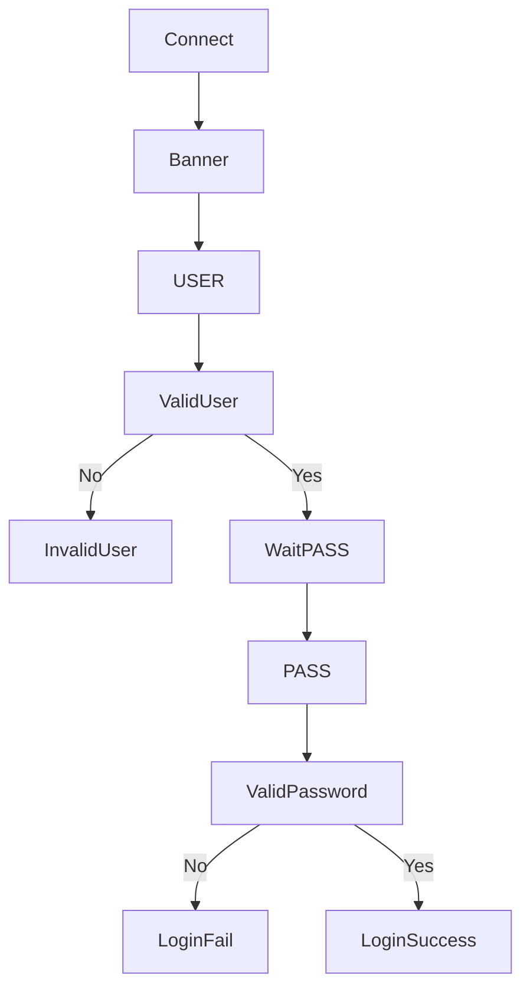
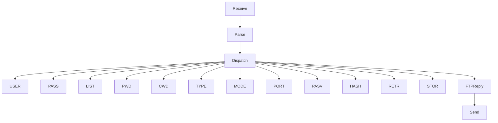
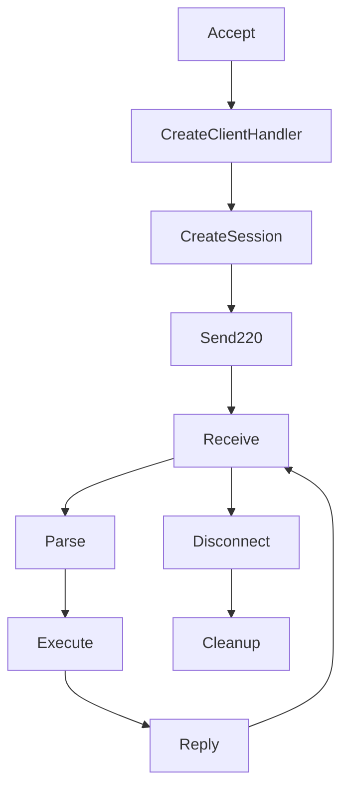
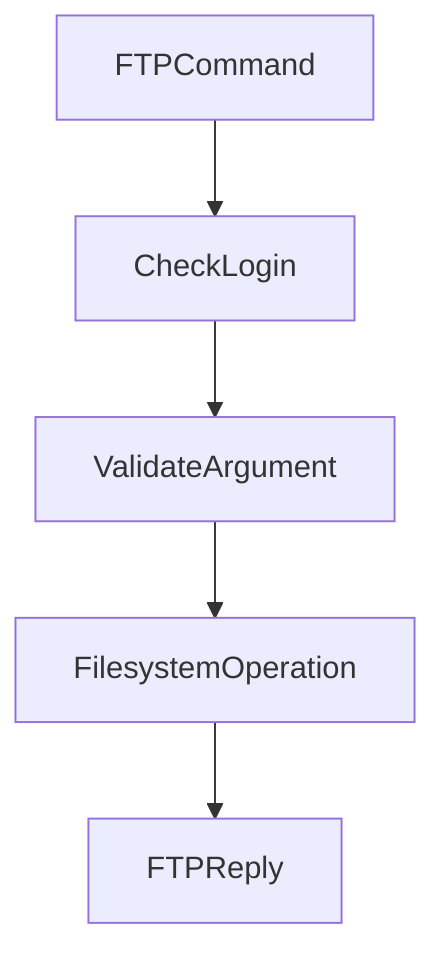
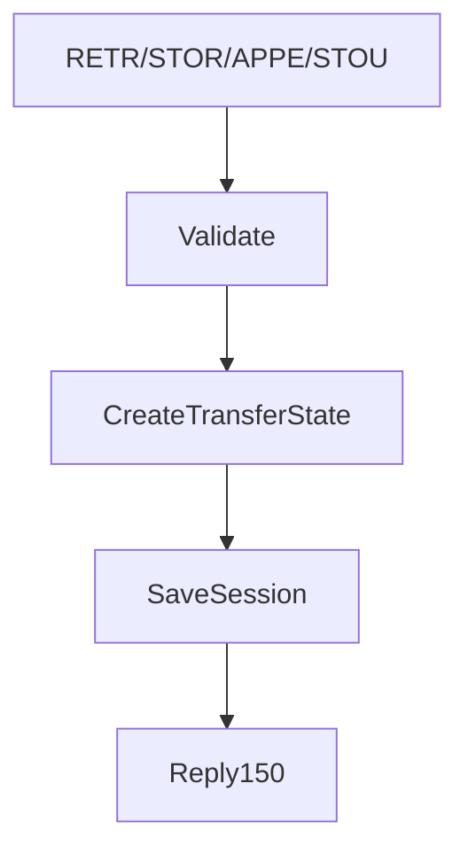
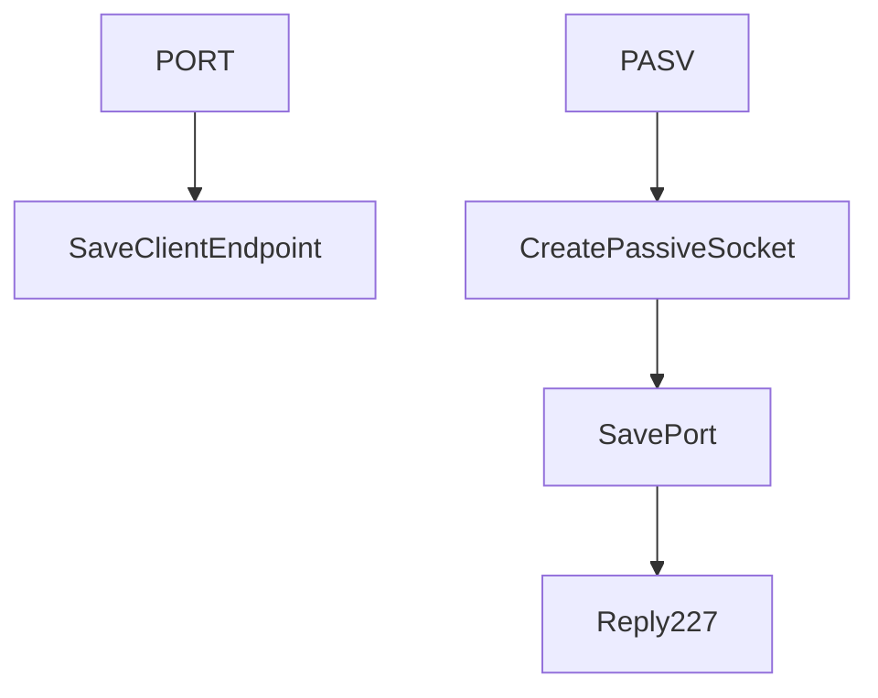

# Technical Report — Hybrid FTP

> This document follows the seven mandatory sections in Section 2.4 of the
> project specification. Each member completes the sections related to their
> implementation.

---

## 1. Application Scenario & Protocol Interaction

The Hybrid FTP server uses a dedicated TCP control connection to process FTP
commands. Each connected client owns an independent TCP session handled by a
separate thread.

After a client connects, the server immediately replies with:

```text
220 Hybrid FTP Server Ready
```

The client authenticates using the standard FTP login sequence:

```text
USER admin
PASS 123456
```

Once authentication succeeds, every command is parsed by `CommandParser`,
dispatched through `CommandHandler`, and executed using the client's private
`Session`.

Role A also prepares the control information required for future UDP data
transfer. Commands such as `PORT`, `PASV`, `TYPE`, `MODE`, `RETR`, `STOR`,
`STOU`, `APPE`, and `ABOR` update the transfer state inside the session, while
the actual UDP reliable transmission will be completed during Role B
integration.

---

## 2. Project-Wide Data Structures

### 2.1 FTP Control Command Format (Role A)

Every FTP command follows the standard format

```text
COMMAND [argument]\r\n
```

Examples:

```text
USER admin
PASS 123456
PWD
CWD test
TYPE I
MODE S
PASV
PORT 127,0,0,1,10,10
LIST
```

The TCP control channel receives raw bytes from the socket. `CommandParser`
splits the request into the command name and its argument before dispatching it
to `CommandHandler`.

Example:

```python
class FTPCommand:

    def __init__(self,name,argument):

        self.name=name
        self.argument=argument
```

Separating parsing from execution keeps the command-processing pipeline modular
and easier to maintain.

---

### 2.2 Session Structure (Role A)

Each connected client owns an independent session.

```python
class Session:

    def __init__(self, ftp_root="./ftp_root"):

        self.username = None
        self.is_logged_in = False

        self.ftp_root = os.path.abspath(ftp_root)
        self.current_dir = self.ftp_root

        self.rename_from = None

        self.transfer_type = "I"
        self.transfer_mode = "S"

        self.data_host = None
        self.data_port = None
        self.data_mode = None

        self.current_transfer = None
        self.transfer_cancelled = False
```

| Attribute | Meaning |
|-----------|---------|
| username | Current authenticated username |
| is_logged_in | Login status |
| ftp_root | FTP root directory |
| current_dir | Current working directory |
| rename_from | Temporary filename used by RNFR/RNTO |
| transfer_type | ASCII/Binary transfer type |
| transfer_mode | FTP transfer mode |
| data_host | Active/Passive data IP |
| data_port | Active/Passive data port |
| data_mode | ACTIVE or PASSIVE |
| current_transfer | Information about the current upload/download |
| transfer_cancelled | Transfer cancellation flag |

Each client thread owns exactly one Session object, preventing state sharing
between concurrent clients.

---

### 2.3 FTP Reply Structure (Role A)

FTP replies are centralized inside the `FTPReply` class instead of scattering
literal strings throughout the project.

Example:

```python
FTPReply.READY
FTPReply.USER_OK
FTPReply.LOGIN_OK
FTPReply.QUIT
FTPReply.NOT_IMPLEMENTED
```

Using predefined replies improves readability and reduces duplicated reply
codes.

---

## 3. Functional Workflows (Flowcharts)

### 3.1 Authentication Workflow (Role A)



If `PASS` is sent before `USER`, the server replies

```text
503 Login with USER first
```

Commands requiring authentication return

```text
530 Not logged in
```

until login succeeds.

---

### 3.2 Command Processing Workflow (Role A)



Every command is parsed once and dispatched to its corresponding member
function inside `CommandHandler`.

---

### 3.3 Client Thread Workflow (Role A)



Each client owns

- one TCP socket
- one Session
- one ClientHandler thread

allowing multiple clients to work independently.

---

### 3.4 File Command Workflow (Role A)



Supported filesystem commands include

- PWD
- CWD
- CDUP
- LIST
- NLST
- MKD
- RMD
- DELE
- RNFR
- RNTO

---

### 3.5 Transfer Preparation Workflow (Role A)



Transfer commands only initialize transfer metadata.

Actual UDP transmission will be implemented by Role B.

---

### 3.6 Active / Passive Mode (Role A)



The `PORT` command stores the client's IP and port.

The `PASV` command creates a passive socket and returns the listening endpoint
using FTP reply `227`.

---

## 4. Task Assignment Matrix

| Module | Owner | Collaborators |
|---------|-------|---------------|
| TCP control connection | Role A | Role C |
| Command parser | Role A | — |
| Command dispatcher | Role A | — |
| FTP reply management | Role A | — |
| Session management | Role A | Role C |
| Authentication | Role A | — |
| Transfer preparation | Role A | Role B |
| UDP reliable transfer | Role B | Role A |
| Filesystem security | Role C | Role A |
| Thread management | Role C | Role A |

---

## 5. Self-Assessment & Peer Evaluation

### 5.1 Role A — Self-Assessment

Role A completed the TCP control channel and refactored the original monolithic
implementation into modular components.

The implementation now consists of

- `ClientHandler`
- `CommandHandler`
- `CommandParser`
- `Session`
- `FTPReply`

Role A successfully implemented and tested the following FTP commands:

- USER
- PASS
- QUIT
- PWD
- CWD
- CDUP
- LIST
- NLST
- MKD
- RMD
- DELE
- RNFR
- RNTO
- TYPE
- MODE
- PORT
- PASV
- RETR
- STOR
- STOU
- APPE
- HASH
- ABOR

All commands were manually tested using Telnet. Both successful operations and
error cases such as invalid login, missing parameters, nonexistent files, and
unsupported commands returned the correct FTP reply codes without crashing the
server.

Transfer-related commands currently prepare session state and are ready for
integration with the UDP Reliable Data Transfer module developed in Role B.

---

## 6. GenAI Usage & Code Refinement Log

Role A records every GenAI interaction in

```
docs/genai-log-a.md
```

including

- Prompt
- Raw AI output
- Manual refinement
- Final integrated implementation

---

## 7. Application Demo Evidence

### 7.1 TCP Control Commands

Successful demonstrations include

- USER/PASS authentication
- PWD
- CWD
- CDUP
- LIST
- NLST
- MKD
- RMD
- DELE
- RNFR/RNTO
- TYPE
- MODE
- PORT
- PASV
- HASH
- RETR
- STOR
- STOU
- APPE
- ABOR
- QUIT

Terminal screenshots and Telnet logs will be attached in the final submission.

### 7.2 Integration Status

Role A has completed all TCP command-processing modules and session management.

The remaining work is integrating the transfer commands with the UDP Reliable
Data Transfer implementation provided by Role B.