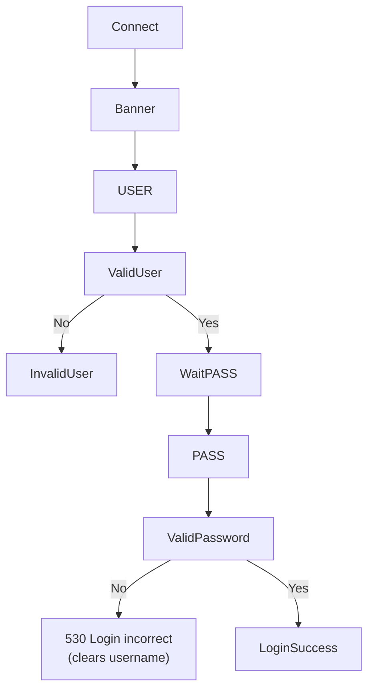
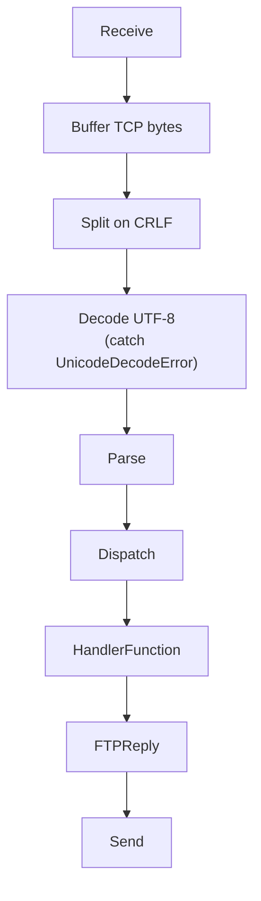
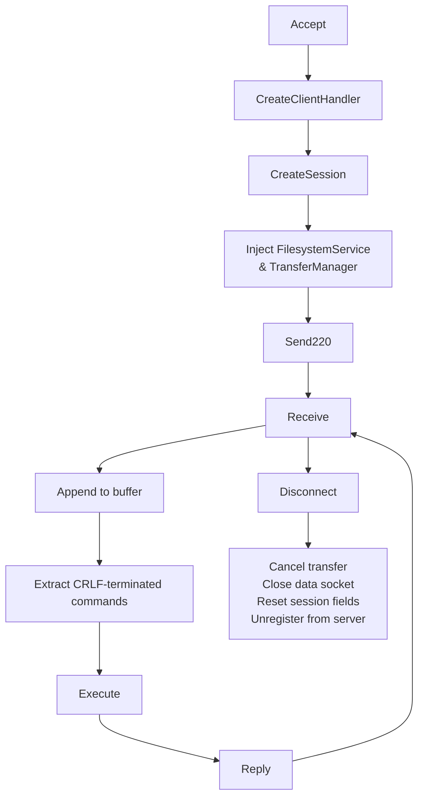
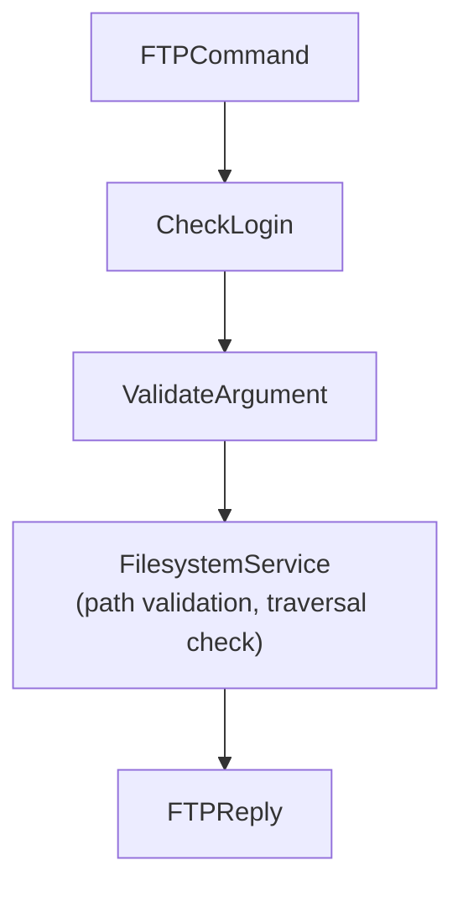
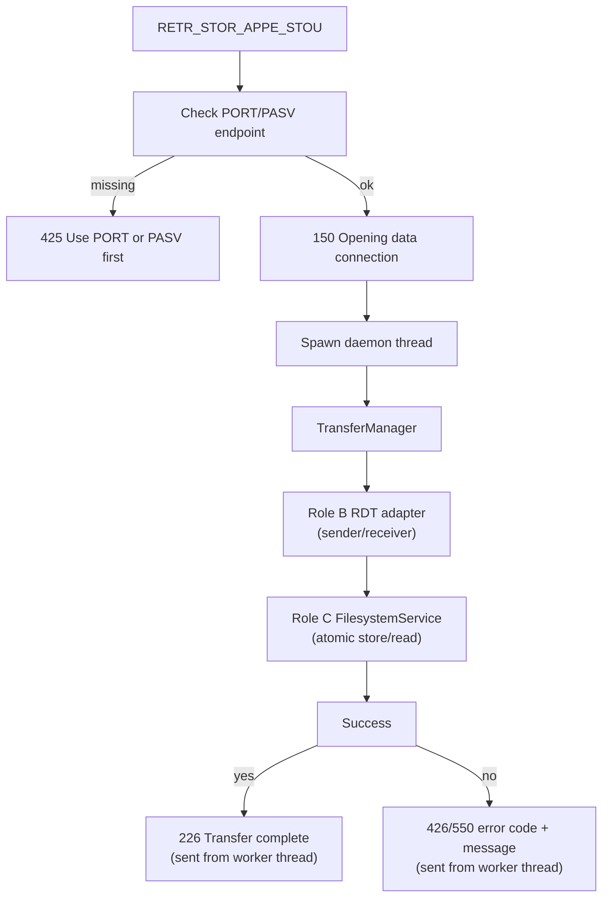
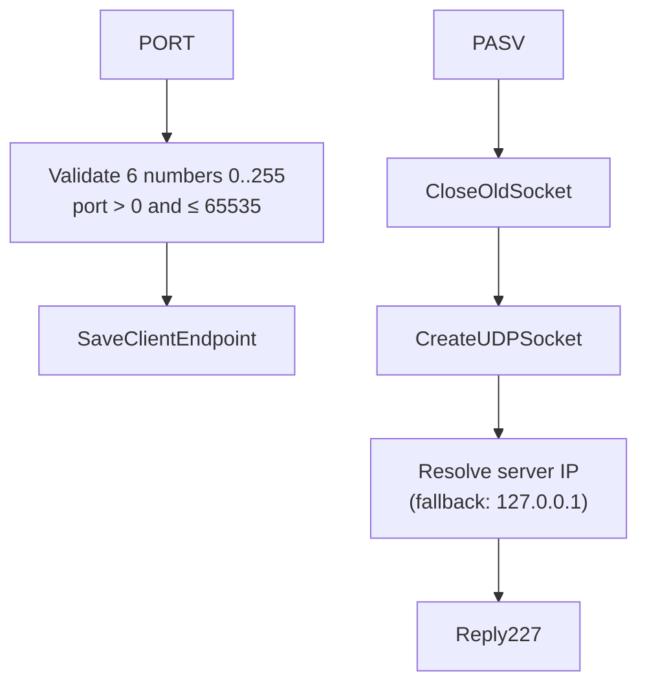

# Technical Report — Hybrid FTP — Role A

> This document follows the seven mandatory sections in Section 2.4 of the
> project specification. Each member completes the sections related to their
> implementation.

---

## 1. Application Scenario & Protocol Interaction

The Hybrid FTP server uses a dedicated TCP control connection to process FTP
commands. Each connected client owns an independent TCP session handled by a
separate thread.

After a client connects, the server immediately replies with:

```text
220 Hybrid FTP Server Ready
```

The client authenticates using the standard FTP login sequence:

```text
USER admin
PASS 123456
```

Once authentication succeeds, every command is parsed by `CommandParser`,
dispatched through `CommandHandler`, and executed using the client's private
`Session`.

Role A also prepares the control information required for UDP data transfer.
Commands such as `PORT`, `PASV`, `TYPE`, `MODE`, `RETR`, `STOR`, `STOU`,
`APPE`, and `ABOR` interact with `TransferManager`, which delegates actual
UDP reliable transmission to the Role B adapter and path operations to the
Role C `FilesystemService`.

Transfer commands (`RETR`, `STOR`, `STOU`, `APPE`) reply `150` immediately
then run the RDT transfer in a daemon thread, sending `226` or `4xx` once
the transfer completes or fails.

---

## 2. Project-Wide Data Structures

### 2.1 FTP Control Command Format (Role A)

Every FTP command follows the standard format

```text
COMMAND [argument]\r\n
```

Examples:

```text
USER admin
PASS 123456
PWD
CWD test
TYPE I
MODE S
PASV
PORT 127,0,0,1,10,10
LIST
```

The TCP control channel receives raw bytes from the socket. `ClientHandler`
buffers incomplete lines and splits on `\r\n`. `CommandParser` then splits the
request into the command name and its argument before dispatching it to
`CommandHandler`.

Example:

```python
class FTPCommand:

    def __init__(self, name, argument):

        self.name = name
        self.argument = argument
```

Separating parsing from execution keeps the command-processing pipeline modular
and easier to maintain.

---

### 2.2 Session Structure (Role A)

Each connected client owns an independent session.

```python
class Session:

    def __init__(self, ftp_root="./ftp_root"):

        self.username = None
        self.is_logged_in = False

        self.ftp_root = os.path.abspath(ftp_root)
        self.current_dir = self.ftp_root

        self.rename_from = None

        self.transfer_type = "I"
        self.transfer_mode = "S"

        self.data_host = None
        self.data_port = None
        self.data_mode = None
        self.data_socket = None

        self.current_transfer = None
        self.transfer_cancelled = False
        self.transfer_cancel_event = None
        self.session_id = None
```

| Attribute | Meaning |
|-----------|---------|
| username | Current authenticated username |
| is_logged_in | Login status |
| ftp_root | FTP root directory |
| current_dir | Current working directory |
| rename_from | Temporary filename used by RNFR/RNTO |
| transfer_type | ASCII/Binary transfer type |
| transfer_mode | FTP transfer mode |
| data_host | Active/Passive data IP |
| data_port | Active/Passive data port |
| data_mode | ACTIVE or PASSIVE |
| data_socket | UDP socket (PASV) or None (ACTIVE) |
| current_transfer | Information about the current upload/download |
| transfer_cancelled | Transfer cancellation flag |
| transfer_cancel_event | `threading.Event` for cooperative cancellation |
| session_id | Unique session identifier assigned by server |

Each client thread owns exactly one Session object, preventing state sharing
between concurrent clients.

---

### 2.3 FTP Reply Structure (Role A)

FTP replies are centralized inside the `FTPReply` class instead of scattering
literal strings throughout the project.

Example:

```python
FTPReply.READY
FTPReply.USER_OK
FTPReply.LOGIN_OK
FTPReply.QUIT
FTPReply.NOT_IMPLEMENTED
```

Using predefined replies improves readability and reduces duplicated reply
codes.

---

## 3. Functional Workflows (Flowcharts)

### 3.1 Authentication Workflow (Role A)



New `USER` command resets `is_logged_in = False` and `rename_from = None`
per RFC 959. If `PASS` is sent before `USER`, the server replies `503 Login
with USER first`. Commands requiring authentication return `530 Not logged in`
until login succeeds.

---

### 3.2 Command Processing Workflow (Role A)



Every command is parsed once and dispatched to its corresponding member
function inside `CommandHandler`.

---

### 3.3 Client Thread Workflow (Role A)



Each client owns

- one TCP socket
- one Session
- one ClientHandler thread
- one TransferManager with injected FilesystemService

allowing multiple clients to work independently.

---

### 3.4 File Command Workflow (Role A)



All path operations go through `FilesystemService` — no direct `os.path`
calls inside `CommandHandler`.

---

### 3.5 Transfer Workflow — 150 → 226/4xx (Role A)



TCP command thread keeps receiving commands (including `ABOR`) while transfer
runs in the background. `ABOR` calls `TransferManager.cancel(session)` which
sets a `threading.Event` and closes the data socket.

---

### 3.6 Active / Passive Mode (Role A)



The `PORT` command validates all 6 comma-separated numbers (range, port > 0,
not > 65535) before storing the client's IP and port. The `PASV` command
closes any existing data socket, creates a new UDP socket, resolves the real
server IP, and returns the endpoint via reply `227`.

---

## 4. Task Assignment Matrix

| Module | Owner | Collaborators |
|---------|-------|---------------|
| TCP control connection | Role A | Role C |
| Command parser | Role A | — |
| Command dispatcher | Role A | — |
| FTP reply management | Role A | — |
| Session management | Role A | Role C |
| Authentication | Role A | — |
| Transfer orchestration | Role A | Role B, Role C |
| UDP reliable transfer | Role B | Role A |
| Filesystem security | Role C | Role A |
| Thread management | Role C | Role A |

---

## 5. Self-Assessment & Peer Evaluation

### 5.1 Role A — Self-Assessment (week 2.5 update)

Role A completed the TCP control channel, refactored the original monolithic
implementation into modular components, and integrated with Role B's RDT
adapter and Role C's FilesystemService.

**Completed modules:**

- `ClientHandler` — TCP buffer, CRLF framing, UnicodeDecodeError handling, cleanup
- `CommandHandler` — full command set with argument validation and reply codes
- `CommandParser` — single-responsibility parser
- `Session` — per-client state, isolated from other clients
- `FTPReply` — centralized reply constants
- `TransferManager` — transfer lifecycle, 150→226 threading, cancellation

**Implemented and tested FTP commands:**

USER, PASS, QUIT, NOOP, PWD, CWD, CDUP, MKD, RMD, DELE, RNFR, RNTO, LIST,
NLST, SIZE, MDTM, STAT, HASH, TYPE, MODE, HELP, PORT, PASV, RETR, STOR,
STOU, APPE, ABOR

**Security and correctness properties verified by tests:**

- TCP framing: fragmented commands, two commands in one recv, bad UTF-8
- PATH: all operations go through FilesystemService (no raw os.path)
- Auth: new USER resets login state; wrong password clears username
- PORT: validates 6 numbers 0–255, port > 0 and ≤ 65535, rejects non-numeric
- PASV: closes old socket before creating new; resolves real server IP
- RNFR/RNTO: state reset on interruption, QUIT, disconnect, empty arg
- Transfer: 150 sent immediately; 226/4xx sent from worker thread after completion
- ABOR: calls TransferManager.cancel(), cancels transfer event, closes data socket
- Cleanup: cancels transfer, closes data socket, clears all session fields, unregisters

**Test results (07/08/2026):** 48 tests pass in `tests/test_commands.py`,
`tests/test_command_parser.py`, `tests/test_session.py` and
`tests/test_transfer_manager.py`.

---

## 6. GenAI Usage & Code Refinement Log

Role A records every GenAI interaction in

```
docs/genai-log-a.md
```

including

- Prompt
- Raw AI output
- Manual refinement
- Final integrated implementation

---

## 7. Application Demo Evidence

### 7.1 TCP Control Commands

All commands implemented and tested:

USER, PASS, QUIT, NOOP, PWD, CWD, CDUP, MKD, RMD, DELE, RNFR, RNTO, LIST,
NLST, SIZE, MDTM, STAT, HASH, TYPE, MODE, HELP, PORT, PASV, RETR, STOR,
STOU, APPE, ABOR

### 7.2 Integration Status (07/08/2026)

| Component | Status |
|-----------|--------|
| TCP buffer + CRLF framing | ✅ Complete, tested |
| All FTP commands + arg validation | ✅ Complete, tested |
| Auth reset on new USER/QUIT | ✅ Complete, tested |
| PORT validation (range, port > 0) | ✅ Complete, tested |
| PASV socket replacement + real IP | ✅ Complete, tested |
| FilesystemService integration | ✅ Complete (no raw os.path) |
| Transfer threading (150 → 226) | ✅ Complete, tested |
| ABOR via TransferManager.cancel | ✅ Complete, tested |
| ClientHandler cleanup | ✅ Complete, tested |
| Session isolation | ✅ Complete, tested |
| Unit tests ≥ 48 passing | ✅ 48 passed |
| End-to-end RETR/STOR via RDT | ⏳ Pending Role B adapter |

Terminal screenshots and Telnet logs will be attached in the final submission.
