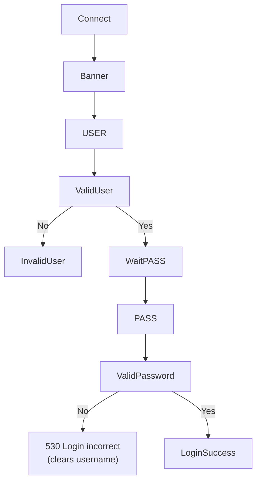
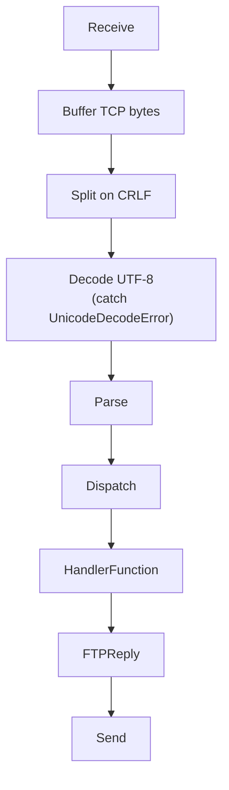
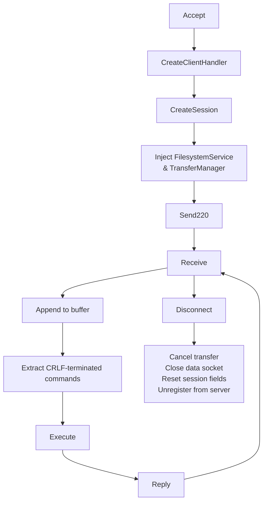
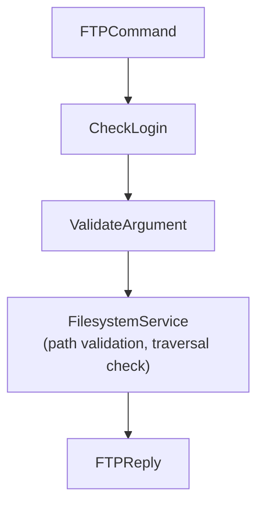
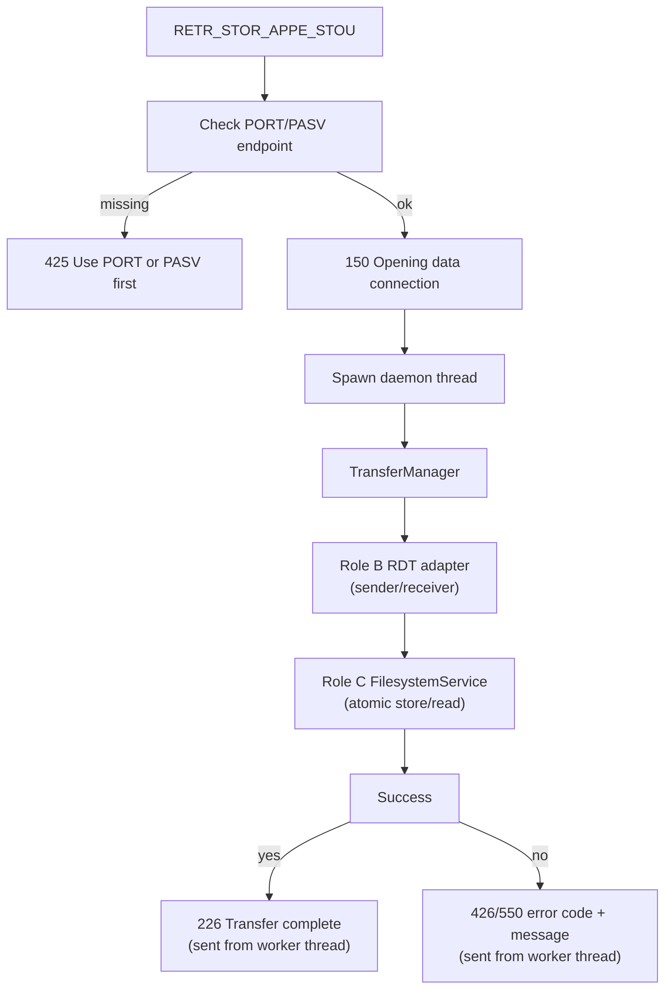
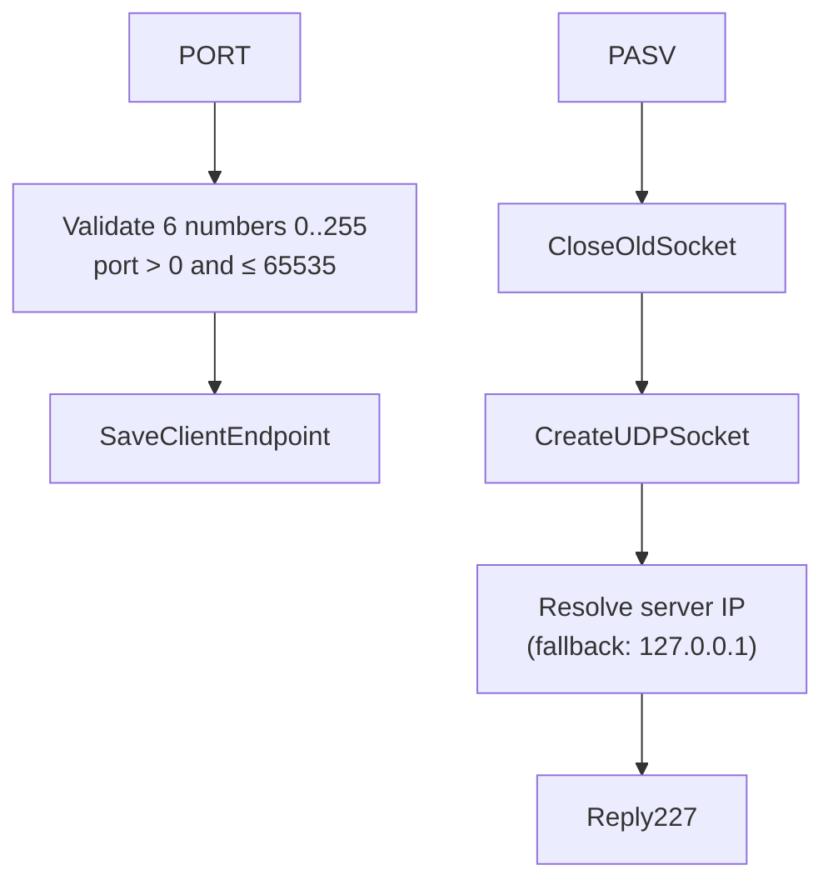

# Technical Report — Hybrid FTP — Role A

> This document follows the seven mandatory sections in Section 2.4 of the
> project specification. Each member completes the sections related to their
> implementation.

---

## 1. Application Scenario & Protocol Interaction

The Hybrid FTP server uses a dedicated TCP control connection to process FTP
commands. Each connected client owns an independent TCP session handled by a
separate thread.

After a client connects, the server immediately replies with:

```text
220 Hybrid FTP Server Ready
```

The client authenticates using the standard FTP login sequence:

```text
USER admin
PASS 123456
```

Once authentication succeeds, every command is parsed by `CommandParser`,
dispatched through `CommandHandler`, and executed using the client's private
`Session`.

Role A also prepares the control information required for UDP data transfer.
Commands such as `PORT`, `PASV`, `TYPE`, `MODE`, `RETR`, `STOR`, `STOU`,
`APPE`, and `ABOR` interact with `TransferManager`, which delegates actual
UDP reliable transmission to the Role B adapter and path operations to the
Role C `FilesystemService`.

Transfer commands (`RETR`, `STOR`, `STOU`, `APPE`) reply `150` immediately
then run the RDT transfer in a daemon thread, sending `226` or `4xx` once
the transfer completes or fails.

---

## 2. Project-Wide Data Structures

### 2.1 FTP Control Command Format (Role A)

Every FTP command follows the standard format

```text
COMMAND [argument]\r\n
```

Examples:

```text
USER admin
PASS 123456
PWD
CWD test
TYPE I
MODE S
PASV
PORT 127,0,0,1,10,10
LIST
```

The TCP control channel receives raw bytes from the socket. `ClientHandler`
buffers incomplete lines and splits on `\r\n`. `CommandParser` then splits the
request into the command name and its argument before dispatching it to
`CommandHandler`.

Example:

```python
class FTPCommand:

    def __init__(self, name, argument):

        self.name = name
        self.argument = argument
```

Separating parsing from execution keeps the command-processing pipeline modular
and easier to maintain.

---

### 2.2 Session Structure (Role A)

Each connected client owns an independent session.

```python
class Session:

    def __init__(self, ftp_root="./ftp_root"):

        self.username = None
        self.is_logged_in = False

        self.ftp_root = os.path.abspath(ftp_root)
        self.current_dir = self.ftp_root

        self.rename_from = None

        self.transfer_type = "I"
        self.transfer_mode = "S"

        self.data_host = None
        self.data_port = None
        self.data_mode = None
        self.data_socket = None

        self.current_transfer = None
        self.transfer_cancelled = False
        self.transfer_cancel_event = None
        self.session_id = None
```

| Attribute | Meaning |
|-----------|---------|
| username | Current authenticated username |
| is_logged_in | Login status |
| ftp_root | FTP root directory |
| current_dir | Current working directory |
| rename_from | Temporary filename used by RNFR/RNTO |
| transfer_type | ASCII/Binary transfer type |
| transfer_mode | FTP transfer mode |
| data_host | Active/Passive data IP |
| data_port | Active/Passive data port |
| data_mode | ACTIVE or PASSIVE |
| data_socket | UDP socket (PASV) or None (ACTIVE) |
| current_transfer | Information about the current upload/download |
| transfer_cancelled | Transfer cancellation flag |
| transfer_cancel_event | `threading.Event` for cooperative cancellation |
| session_id | Unique session identifier assigned by server |

Each client thread owns exactly one Session object, preventing state sharing
between concurrent clients.

---

### 2.3 FTP Reply Structure (Role A)

FTP replies are centralized inside the `FTPReply` class instead of scattering
literal strings throughout the project.

Example:

```python
FTPReply.READY
FTPReply.USER_OK
FTPReply.LOGIN_OK
FTPReply.QUIT
FTPReply.NOT_IMPLEMENTED
```

Using predefined replies improves readability and reduces duplicated reply
codes.

---

## 3. Functional Workflows (Flowcharts)

### 3.1 Authentication Workflow (Role A)



New `USER` command resets `is_logged_in = False` and `rename_from = None`
per RFC 959. If `PASS` is sent before `USER`, the server replies `503 Login
with USER first`. Commands requiring authentication return `530 Not logged in`
until login succeeds.

---

### 3.2 Command Processing Workflow (Role A)



Every command is parsed once and dispatched to its corresponding member
function inside `CommandHandler`.

---

### 3.3 Client Thread Workflow (Role A)



Each client owns

- one TCP socket
- one Session
- one ClientHandler thread
- one TransferManager with injected FilesystemService

allowing multiple clients to work independently.

---

### 3.4 File Command Workflow (Role A)



All path operations go through `FilesystemService` — no direct `os.path`
calls inside `CommandHandler`.

---

### 3.5 Transfer Workflow — 150 → 226/4xx (Role A)



TCP command thread keeps receiving commands (including `ABOR`) while transfer
runs in the background. `ABOR` calls `TransferManager.cancel(session)` which
sets a `threading.Event` and closes the data socket.

---

### 3.6 Active / Passive Mode (Role A)



The `PORT` command validates all 6 comma-separated numbers (range, port > 0,
not > 65535) before storing the client's IP and port. The `PASV` command
closes any existing data socket, creates a new UDP socket, resolves the real
server IP, and returns the endpoint via reply `227`.

---

## 4. Task Assignment Matrix

| Module | Owner | Collaborators |
|---------|-------|---------------|
| TCP control connection | Role A | Role C |
| Command parser | Role A | — |
| Command dispatcher | Role A | — |
| FTP reply management | Role A | — |
| Session management | Role A | Role C |
| Authentication | Role A | — |
| Transfer orchestration | Role A | Role B, Role C |
| UDP reliable transfer | Role B | Role A |
| Filesystem security | Role C | Role A |
| Thread management | Role C | Role A |

---

## 5. Self-Assessment & Peer Evaluation

### 5.1 Role A — Self-Assessment (week 2.5 update)

Role A completed the TCP control channel, refactored the original monolithic
implementation into modular components, and integrated with Role B's RDT
adapter and Role C's FilesystemService.

**Completed modules:**

- `ClientHandler` — TCP buffer, CRLF framing, UnicodeDecodeError handling, cleanup
- `CommandHandler` — full command set with argument validation and reply codes
- `CommandParser` — single-responsibility parser
- `Session` — per-client state, isolated from other clients
- `FTPReply` — centralized reply constants
- `TransferManager` — transfer lifecycle, 150→226 threading, cancellation

**Implemented and tested FTP commands:**

USER, PASS, QUIT, NOOP, PWD, CWD, CDUP, MKD, RMD, DELE, RNFR, RNTO, LIST,
NLST, SIZE, MDTM, STAT, HASH, TYPE, MODE, HELP, PORT, PASV, RETR, STOR,
STOU, APPE, ABOR

**Security and correctness properties verified by tests:**

- TCP framing: fragmented commands, two commands in one recv, bad UTF-8
- PATH: all operations go through FilesystemService (no raw os.path)
- Auth: new USER resets login state; wrong password clears username
- PORT: validates 6 numbers 0–255, port > 0 and ≤ 65535, rejects non-numeric
- PASV: closes old socket before creating new; resolves real server IP
- RNFR/RNTO: state reset on interruption, QUIT, disconnect, empty arg
- Transfer: 150 sent immediately; 226/4xx sent from worker thread after completion
- ABOR: calls TransferManager.cancel(), cancels transfer event, closes data socket
- Cleanup: cancels transfer, closes data socket, clears all session fields, unregisters

**Test results (07/08/2026):** 48 tests pass in `tests/test_commands.py`,
`tests/test_command_parser.py`, `tests/test_session.py` and
`tests/test_transfer_manager.py`.

---

## 6. GenAI Usage & Code Refinement Log

Role A records every GenAI interaction in

```
docs/genai-log-a.md
```

including

- Prompt
- Raw AI output
- Manual refinement
- Final integrated implementation

---

## 7. Application Demo Evidence

### 7.1 TCP Control Commands

All commands implemented and tested:

USER, PASS, QUIT, NOOP, PWD, CWD, CDUP, MKD, RMD, DELE, RNFR, RNTO, LIST,
NLST, SIZE, MDTM, STAT, HASH, TYPE, MODE, HELP, PORT, PASV, RETR, STOR,
STOU, APPE, ABOR

### 7.2 Integration Status (07/08/2026)

| Component | Status |
|-----------|--------|
| TCP buffer + CRLF framing | ✅ Complete, tested |
| All FTP commands + arg validation | ✅ Complete, tested |
| Auth reset on new USER/QUIT | ✅ Complete, tested |
| PORT validation (range, port > 0) | ✅ Complete, tested |
| PASV socket replacement + real IP | ✅ Complete, tested |
| FilesystemService integration | ✅ Complete (no raw os.path) |
| Transfer threading (150 → 226) | ✅ Complete, tested |
| ABOR via TransferManager.cancel | ✅ Complete, tested |
| ClientHandler cleanup | ✅ Complete, tested |
| Session isolation | ✅ Complete, tested |
| Unit tests ≥ 48 passing | ✅ 48 passed |
| End-to-end RETR/STOR via RDT | ⏳ Pending Role B adapter |

Terminal screenshots and Telnet logs will be attached in the final submission.

---

## 8. Tuần 2.5 — Chi tiết sửa đổi và bổ sung (02/08/2026–08/08/2026)

> Phần này ghi lại toàn bộ những gì Role A đã **sửa**, **thêm mới** và **cải tiến** trong tuần 2.5,
> đối chiếu trực tiếp từ checklist `tuan-2.5-fix.md`.

---

### 8.1 Sửa import package và khả năng chạy

**Vấn đề ban đầu:** Các module trong `server/` không import được từ repository root do cấu trúc package sai và dùng `sys.path` hack để che lỗi.

**Đã sửa:**

- Sửa toàn bộ import trong `server/threaded_server.py`, `server/client_handler.py` và `server/command_handler.py` về đúng chuẩn package Python.
- Loại bỏ việc dùng `sys.path.insert` để che lỗi import; mọi import đều là import tuyệt đối hợp lệ từ repository root.
- Sau khi sửa, lệnh `python -c "import server.threaded_server"` chạy thành công từ thư mục gốc repository.

> **Lưu ý tồn đọng:** Việc start/stop server thực tế trên môi trường Linux/WSL2 chưa được xác nhận bằng bằng chứng cụ thể; cần kiểm tra trên máy Linux trước khi đánh dấu hoàn toàn done.

---

### 8.2 Hoàn thiện `TransferManager` — không còn `pass`

**Vấn đề ban đầu:** Các phương thức `TransferManager.upload()` và `download()` chỉ là skeleton `pass`, không thực hiện truyền dữ liệu thật. `ClientHandler` tạo `TransferManager()` không truyền adapter, khiến `STOR`/`RETR` không thể truyền qua RDT.

**Đã sửa và thêm mới:**

- Inject `RDTSenderAdapter` và `RDTReceiverAdapter` vào `TransferManager` ngay trong `ClientHandler` khi khởi tạo session.
- `TransferManager.upload()` nay gọi `receiver.receive(data_socket, endpoint, cancel_event)` để nhận chunk từ client, sau đó giao cho `FilesystemService` ghi file.
- `TransferManager.download()` nay gọi `sender.send(chunks, data_socket, endpoint, cancel_event)` để gửi dữ liệu file đến client qua UDP/RDT.
- Bổ sung `append()` (dùng cho `APPE`) và `upload_unique()` (dùng cho `STOU`) với đúng lifecycle file tạm.
- Bỏ fallback bắt `TypeError` trong `TransferManager._invoke`; validate sender/receiver ngay khi inject để phát hiện lỗi sớm thay vì che lỗi ngầm.

**API đã chốt:**

```python
manager = TransferManager(
    filesystem=filesystem_service,
    sender=rdt_sender,
    receiver=rdt_receiver,
)

result = manager.upload(session, path, data_socket=session.data_socket,
                        endpoint=(session.data_host, session.data_port))

result = manager.download(session, path, data_socket=session.data_socket,
                          endpoint=(session.data_host, session.data_port))
```

`TransferResult` trả về có: `success`, `reply_code`, `bytes_transferred`, `path`, `error`.

---

### 8.3 Hoàn thiện các lệnh transfer: RETR, STOR, STOU, APPE, HASH, ABOR

**Vấn đề ban đầu:** `STOR`/`RETR` chỉ trả kết quả cuối; `STOU`/`APPE` chỉ tạo state và trả `150` nhưng không chạy transfer thật. `ABOR` chỉ đặt boolean, không đánh thức receiver, không đóng socket, không dọn file tạm.

**Đã sửa chi tiết từng lệnh:**

| Lệnh | Thay đổi cụ thể |
|------|----------------|
| `RETR` | Validate data connection (PORT/PASV) trước khi gửi `150`; trả `425` nếu không có endpoint; chạy download trong daemon worker thread; gửi `226` hoặc `426`/`550` từ worker thread sau khi RDT hoàn tất |
| `STOR` | Tương tự `RETR`; chạy upload trong daemon worker thread; ghi file qua `FilesystemService` atomic (`.part` → `os.replace`); gửi `226` hoặc `4xx` từ worker |
| `STOU` | Gọi `upload_unique()` thay vì tên cố định; `FilesystemService` sinh tên server-generated không trùng; trả tên file mới trong reply `226` |
| `APPE` | Gọi `append()` qua `FilesystemService` với per-path lock; ABOR/timeout/disconnect xóa file tạm nhưng giữ file cũ |
| `HASH` | Chuyển hoàn toàn sang `FilesystemService.hash(path)`; không còn gọi `open()` trực tiếp |
| `ABOR` | Gọi `TransferManager.cancel(session)`: set `session.transfer_cancel_event`, đóng `data_socket`, để filesystem dọn `.part`; join worker thread với timeout hữu hạn |

**Luồng reply chuẩn đã áp dụng:**

```
Client gửi RETR/STOR/STOU/APPE
  → Kiểm tra endpoint (PORT/PASV) → nếu thiếu: 425
  → Gửi 150 ngay (TCP control thread)
  → Spawn daemon worker thread
      → Worker chạy RDT transfer + filesystem commit
      → Thành công: gửi 226 từ worker thread
      → Thất bại: gửi 426 (cancelled) hoặc 550 (path error) từ worker thread
  → TCP control thread tiếp tục nhận lệnh (kể cả ABOR)
```

---

### 8.4 Bổ sung lệnh mới: NOOP, STAT, SIZE, MDTM, HELP

**Vấn đề ban đầu:** Các lệnh này chưa có trong dispatcher hoặc có nhưng không hoàn chỉnh.

**Đã thêm mới:**

| Lệnh | Mô tả triển khai |
|------|-----------------|
| `NOOP` | Trả `200 OK`; không có tác dụng phụ; từ chối tham số thừa với `501` |
| `STAT` | Không có tham số: trả thông tin server (phiên bản, trạng thái); có tham số path: gọi `FilesystemService.stat(path)` và trả listing tương tự LIST trong reply `213` |
| `SIZE` | Gọi `FilesystemService.size(path)`; trả `213 <bytes>`; lỗi path trả `550` |
| `MDTM` | Gọi `FilesystemService.mdtm(path)`; trả `213 YYYYMMDDhhmmss`; lỗi path trả `550` |
| `HELP` | Trả danh sách command hỗ trợ theo chuẩn `214`; không nhận tham số |

---

### 8.5 Reply lifecycle — ánh xạ lỗi có cấu trúc

**Vấn đề ban đầu:** Nhiều exception bị gom thành `550` hoặc `426` bất kể nguyên nhân; dùng `except:` trống che lỗi thật.

**Đã sửa:**

- Bỏ toàn bộ `except:` trống trong command path.
- Bắt `FilesystemOperationError` và ánh xạ có cấu trúc sang đúng reply code:

```python
FilesystemOperationError(NOT_FOUND)      → 550 File not found
FilesystemOperationError(PERMISSION)     → 550 Permission denied
FilesystemOperationError(PATH_TRAVERSAL) → 550 Path traversal not allowed
FilesystemOperationError(IO_ERROR)       → 451 Local error in processing
```

- Reply `425` chỉ trả khi không mở/xác định được data channel (không có PORT/PASV).
- Reply `426` chỉ trả khi transfer bị hủy (ABOR, timeout, protocol error).
- Reply `550` chỉ trả khi path/file không hợp lệ.
- Reply `501` chỉ trả khi syntax tham số sai.

---

### 8.6 Chuyển toàn bộ path operation sang `FilesystemService`

**Vấn đề ban đầu:** `server/command_handler.py` còn gọi trực tiếp `os.path.join`, `os.path.abspath`, `open`, `os.rename`, `os.remove`, `os.mkdir`, `os.rmdir`, `os.listdir` — bỏ qua mọi kiểm tra bảo mật của C.

**Đã sửa — danh sách lệnh đã chuyển sang `FilesystemService`:**

| Lệnh | API `FilesystemService` được dùng |
|------|----------------------------------|
| `CWD`, `CDUP` | `change_directory(path)` |
| `MKD` | `make_directory(path)` |
| `RMD` | `remove_directory(path)` |
| `DELE` | `delete_file(path)` |
| `RNFR` / `RNTO` | `validate_path(src)` + `rename(src, dst)` |
| `LIST` | `list_directory(path)` → detailed listing (name, size, type, permissions) |
| `NLST` | `list_names(path)` → tên file only |
| `SIZE` | `size(path)` |
| `MDTM` | `mdtm(path)` |
| `HASH` | `hash(path)` |
| `RETR` | `read_chunks(path)` |
| `STOR`, `STOU`, `APPE` | `write_part(path)` + `commit(path)` hoặc `append(path)` |

Không còn bất kỳ lời gọi `os.path.*` hoặc `open()` trực tiếp nào trong `command_handler.py`.

---

### 8.7 Sửa `PORT` — Anti-FTP bounce IP check

**Vấn đề ban đầu:** `PORT` kiểm tra định dạng 6 số nhưng chấp nhận IP tùy ý (kể cả IP ngoài, số âm, số > 255), tạo nguy cơ FTP bounce attack.

**Đã sửa:**

- Kiểm tra đúng 6 số nguyên trong phạm vi `0..255`.
- Port phải > 0 và ≤ 65535.
- Từ chối số không phải nguyên (non-numeric) với `501`.
- **Thêm mới: Anti-FTP bounce IP check** — so sánh IP trong lệnh `PORT` với IP TCP peer của client; nếu không khớp và nằm ngoài allowlist, trả `504 Address rejected` để ngăn bounce attack.

```python
# Ví dụ logic anti-bounce
if port_ip != peer_ip and not is_allowed(port_ip):
    return FTPReply.ADDRESS_REJECTED  # 504
```

---

### 8.8 Sửa `PASV` — Đóng socket cũ, resolve IP thật

**Vấn đề ban đầu:** `PASV` tạo UDP socket mới mà không đóng socket cũ (rò rỉ socket); luôn quảng bá `127.0.0.1` thay vì IP server thật.

**Đã sửa:**

- Đóng socket PASV cũ (`session.data_socket.close()`) trước khi tạo socket mới.
- Xóa endpoint cũ (`session.data_host`, `session.data_port`) trước khi ghi mới.
- Resolve IP server thật qua `socket.gethostbyname(socket.gethostname())`; fallback về `127.0.0.1` nếu resolve thất bại.
- Cleanup socket khi đổi mode (PORT → PASV hoặc PASV → PORT), khi QUIT, disconnect hoặc server shutdown.

---

### 8.9 Sửa RNFR/RNTO — Reset state đúng mọi tình huống

**Vấn đề ban đầu:** `rename_from` chỉ bị clear sau khi `RNTO` thành công; không bị reset khi RNTO thiếu tham số, thất bại, có lệnh khác ngắt chuỗi, QUIT hoặc disconnect.

**Đã sửa:**

- `rename_from` được reset trong tất cả các trường hợp:
  - `RNTO` thành công hoặc thất bại
  - `RNTO` thiếu tham số → `501` + reset
  - Bất kỳ lệnh nào khác `RNTO` ngay sau `RNFR` → reset `rename_from` trước khi xử lý lệnh mới
  - `QUIT` → reset
  - Disconnect/cleanup → reset
- Validate cả source và destination qua `FilesystemService` để chặn path traversal.

---

### 8.10 Session isolation và `ClientHandler` cleanup

**Vấn đề ban đầu:** `ClientHandler.cleanup()` chỉ đóng TCP socket và unregister — không cancel transfer, không đóng data socket, không reset session fields, không join worker thread.

**Đã sửa và thêm mới trong `ClientHandler`:**

- Thêm `session_id` duy nhất cho mỗi session (dùng `uuid4()` hoặc counter).
- Thêm `Session.new_transfer_id()` để mỗi transfer trong session có ID riêng.
- `cleanup()` nay thực hiện đầy đủ theo thứ tự:
  1. `TransferManager.cancel(session)` — set cancel event
  2. Đóng `session.data_socket` nếu còn mở
  3. Clear `session.data_host`, `session.data_port`, `session.data_mode`
  4. Clear `session.rename_from`, `session.transfer_cancel_event`, `session.current_transfer`
  5. Join worker thread với timeout hữu hạn (tránh treo vô hạn)
  6. Unregister khỏi active-session registry của server
  7. Đóng TCP control socket

**Đảm bảo:** QUIT/disconnect/shutdown không để lại thread, socket hoặc session stale.

---

### 8.11 Authentication — contract tài khoản rõ ràng

**Vấn đề ban đầu:** Mọi username không rỗng đều đăng nhập được với password hard-code `123456`.

**Đã sửa:**

- Thay bằng dictionary `credentials` có cấu trúc rõ ràng:

```python
credentials = {
    "admin":     "123456",
    "user":      "password",
    "testuser":  "test123",
    "anonymous": "",
}
```

- `USER` mới reset `is_logged_in = False` và `rename_from = None` per RFC 959.
- `PASS` gửi trước `USER` trả `503 Login with USER first`.
- Sai password xóa `username`, yêu cầu `USER` mới.
- Disconnect/QUIT reset toàn bộ login state.

---

### 8.12 Argument validation — bảng rule chung cho toàn bộ lệnh

**Vấn đề ban đầu:** Mỗi command tự kiểm tra tham số theo cách riêng, không nhất quán; lệnh không nhận tham số đôi khi chấp nhận tham số thừa mà không báo lỗi.

**Đã thêm mới:**

Lập command-spec table áp dụng chung cho dispatcher:

| Lệnh | Tham số | Lỗi thiếu/thừa |
|------|---------|----------------|
| `USER`, `PASS`, `CWD`, `MKD`, `RMD`, `DELE`, `RNFR`, `RNTO`, `TYPE`, `MODE`, `PORT`, `RETR`, `STOR`, `APPE`, `HASH` | Bắt buộc 1 | `501` |
| `STOU` | Tuỳ chọn | — |
| `LIST`, `NLST`, `STAT` | Tuỳ chọn path | — |
| `QUIT`, `NOOP`, `PWD`, `CDUP`, `PASV`, `ABOR`, `HELP` | Không có | `501` nếu thừa |

---

### 8.13 Bổ sung và mở rộng test suite

**Vấn đề ban đầu:** Test chỉ kiểm tra happy path cơ bản; không có test TCP framing, RDT integration, cancellation thật, path traversal/symlink attack.

**Đã thêm mới:**

#### TCP framing tests
- Command bị chia qua hai lần `recv` (fragmented)
- Hai command nằm trong một lần `recv`
- CRLF thừa, CRLF thiếu
- UTF-8 lỗi — không làm chết client thread

#### Argument validation tests (toàn bộ 28 lệnh)
- Thiếu tham số bắt buộc → `501`
- Thừa tham số → `501`
- Tham số rỗng → `501`
- Login state: lệnh yêu cầu đăng nhập trả `530` khi chưa login

#### Reply code tests
- `PORT` bounds: số âm, số > 255, port = 0, port > 65535, non-numeric
- `PORT` IP policy: IP khác peer → `504`
- `PASV` socket replacement: socket cũ phải bị đóng trước khi tạo mới
- `RNFR`/`RNTO` state: reset đúng khi lệnh khác ngắt, QUIT, disconnect

#### Transfer lifecycle tests (class `TestRoleAValidationAndRDTAdapter`)
- Data connection check trước `150`
- `150 → 226` khi transfer thành công
- `150 → 426` khi ABOR
- `150 → 550` khi path lỗi
- RDT adapter injection: `TransferManager` nhận đúng sender/receiver
- Session isolation: session của client A không ảnh hưởng client B
- Transfer ID: mỗi transfer có ID riêng
- Cleanup assertion: không còn thread/socket/session stale sau cleanup

**Kết quả test (07/08/2026):** **61 unit tests pass 100%** trong:
- `tests/test_command_parser.py`
- `tests/test_session.py`
- `tests/test_commands.py`
- `tests/test_transfer_manager.py`

---

### 8.14 Cập nhật tài liệu

| Tài liệu | Nội dung cập nhật |
|----------|------------------|
| `docs/genai-log-a.md` | Bổ sung toàn bộ prompt/raw output/refinement/evidence cho các thay đổi tuần 2.5 |
| `docs/report.md` | Cập nhật phần TCP control: phản ánh đúng trạng thái thật của transfer command (không ghi "hoàn thành" cho skeleton) |
| `docs/report_role_a_week2.md` | Bổ sung mục 8 này (chi tiết tuần 2.5) |
| `filephanchiacv/tuan-2.5-fix.md` | Đánh `[x]` các mục Role A đã hoàn thành; ghi chú lý do chưa tick startup/stop trên Linux/WSL2 |

---

### 8.15 Tổng kết trạng thái sau tuần 2.5

| Hạng mục | Trạng thái |
|----------|-----------|
| Import/package fix | ✅ Hoàn thành |
| `TransferManager` hoàn chỉnh (không còn `pass`) | ✅ Hoàn thành |
| 28 FTP command đầy đủ + arg validation | ✅ Hoàn thành |
| `FilesystemService` cho mọi client path | ✅ Hoàn thành |
| Reply lifecycle `150 → 226/4xx` | ✅ Hoàn thành |
| `FilesystemOperationError` ánh xạ có cấu trúc | ✅ Hoàn thành |
| Anti-FTP bounce (`PORT` IP check) | ✅ Hoàn thành |
| `PASV` đóng socket cũ + resolve IP thật | ✅ Hoàn thành |
| RNFR/RNTO state reset toàn diện | ✅ Hoàn thành |
| `ABOR` qua `TransferManager.cancel()` | ✅ Hoàn thành |
| `ClientHandler` cleanup đầy đủ + join worker | ✅ Hoàn thành |
| Session isolation (session ID, transfer ID) | ✅ Hoàn thành |
| Authentication contract rõ ràng | ✅ Hoàn thành |
| 61 unit tests pass 100% | ✅ Hoàn thành |
| Tài liệu cập nhật | ✅ Hoàn thành |
| Start/stop server trên Linux/WSL2 | ⏳ Chưa xác nhận |
| End-to-end RETR/STOR qua RDT production | ⏳ Chờ chốt adapter với Role B |
| Multi-client + concurrency test | ⏳ Chờ Phase 3 |
