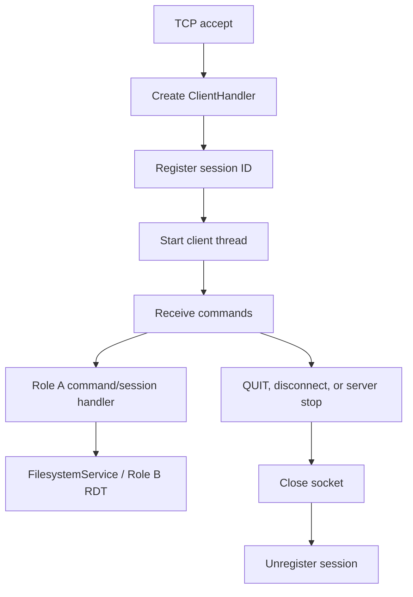
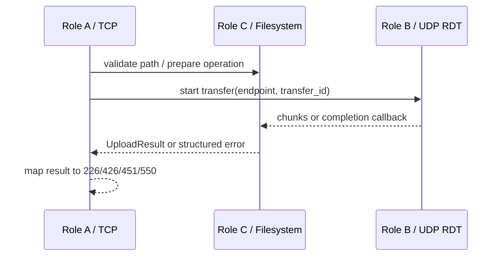

# Role C — Week 2 Integration Contract

> **Snapshot lịch sử, không phải trạng thái hiện tại.** Xem
> `docs/project-status.md` và `docs/requirement-checklist.md` để biết evidence
> và tiến độ final.

## Filesystem API

`common.filesystem_service.FilesystemService` is the only filesystem entry point
that Roles A and B should call. Construct it once with the FTP root. Keep each
session's absolute `cwd` in Role A and pass it into every operation.

- Directory and metadata: `change_directory`, `parent_directory`, `list`,
  `names`, `stat`, `size`, `modified_time`, `make_directory`,
  `remove_directory`, `delete`, `rename`, and `hash`.
- Download: call `prepare_retrieve` or `read_chunks`, then give the validated
  path/chunks to Role B.
- Upload: pass Role B's received chunks to `store`, `store_unique`, or `append`.
  Pass the transfer's `threading.Event` as `cancel_event` so `ABOR` stops the
  write and removes the temporary file.
- Catch `FilesystemOperationError`. Its `reply_code` is ready for Role A:
  `501` for invalid parameters, `550` for unavailable/unsafe paths, `451` for a
  local filesystem failure, and `426` for a cancelled transfer.

## Thread Dispatch and Cleanup



`FTPServer.stop()` snapshots clients while holding the registry lock, releases
the lock, then closes and joins handlers. This order prevents deadlock because a
handler unregisters itself during cleanup.

## Locking and File Lifecycle

Locks are per resolved path, so unrelated transfers remain concurrent. `STOR`
and `APPE` write a hidden `.part` file and use `os.replace` only after all chunks
arrive. A failure or cancellation deletes `.part` and preserves the old target.
`APPE` holds one path lock while copying the old file and adding new chunks, so
two clients cannot interleave bytes. `STOU` selects a UUID-based unused name
while holding the directory lock.

Never hold the server's global client lock while waiting for a UDP ACK.

## TCP–UDP–Filesystem Handoff



Active/PASV endpoint negotiation remains owned by Role A/B. Role C receives the
selected endpoint through their agreed transfer API and must not open a second
TCP data connection.

## Week 2 Evidence and Requirement Mapping

| Requirement area | Role C integration contribution | Evidence |
|---|---|---|
| Filesystem safety | `FilesystemService` owns root validation, atomic commit and cleanup | Filesystem/transfer tests; API contract |
| TCP → UDP → filesystem | Keeps validated path and atomic lifecycle behind `TransferManager` | `tests/test_e2e_transfer.py` passes Active/PASV STOR + RETR |
| File integrity | Server file and downloaded client file are compared by SHA-256 | End-to-end test; manual Active demo reported success |
| Session cleanup | Server owns session registry and handler shutdown path | `FTPServer.stop()` workflow and existing server tests |
| Concurrent clients | Three PASV sessions transfer distinct files in parallel | `test_three_pasv_clients_transfer_independently`: pass in 5.34s |

## Week 2 Manual Demo Evidence

On 08/08/2026, the Active demo command completed:

```powershell
python -m client.demo_transfer .\demo.bin --remote demo-active.bin --mode ACTIVE
```

Observed result:

```text
220 Hybrid FTP Server Ready
Success: ACTIVE upload + download for demo-active.bin
```

This proves one localhost Active upload/download workflow. The user also
confirmed the corresponding localhost PASV manual demo passed. On the same
date, automated evidence verified three concurrent PASV clients. Each used its
own session, remote filename, and download directory; the source, server, and
downloaded SHA-256 values matched for every client. The saved output is
`docs/evidence/week-2.5-three-client.log`.

The complete localhost end-to-end group was then rerun: Active, PASV, three
concurrent clients, ABOR while waiting for UDP, and TCP disconnect while waiting
for UDP all passed (`5 passed in 18.03s`). The saved output is
`docs/evidence/week-2.5-e2e-transfer.log`.

Saved integrity evidence is available in:

- `docs/evidence/week-2.5-active-sha256.txt`
- `docs/evidence/week-2.5-pasv-sha256.txt`

Each file records matching SHA-256 values for the source, FTP-root copy, and
downloaded client copy.

## Limitations and Next Work

- Save Active/PASV manual command output and the three SHA-256 values.
- Run the same transfer workflow from a different machine on the LAN.
- PASV server-log, progress, and success screenshots were saved under
  `docs/evidence/screenshots/` on 08/08/2026 (user confirmation). Active/full
  pytest screenshots are optional supporting evidence for final submission.
- `LIST`/`NLST` đã được chốt là textual result trên TCP control theo đề gốc;
  không cần UDP/RDT cho listing. Xem `docs/api-contract.md` §6.1.
- For LAN, start the server with `--host 0.0.0.0` and its real IPv4 through
  `--advertise-host`; use the same IPv4 in the client `--host` option.
- CLI demo now renders upload/download progress from the RDT callback; server
  logs redact PASS and record session/transfer lifecycle and active sessions.
- RETR now includes the validated total size in RDT START, so download progress
  has a real 0→100% total instead of treating every chunk as complete.
- Full WSL2 verification is complete: `python3 -m pytest -q` collected 189
  tests and reported `189 passed in 106.91s` on 08/08/2026. Output is stored
  in `docs/evidence/week-2.5-pytest.log`.

## Final Week — Go-Back-N Excellent Completion

Role C replaced the production Stop-and-Wait send loop with a bounded Go-Back-N
window of four packets. `START` now requires a valid ACK before data opens; the
sender retries it finitely. DATA/FIN ACKs are cumulative. On timeout, the sender
retransmits every unacknowledged packet from the window base. The receiver still
commits only the expected sequence, re-ACKs the last contiguous sequence for a
duplicate/future packet, and never writes the same payload twice.

The change preserves the RDT header layout, `TransferContext` adapter boundary,
FTP command grammar and A-owned replies. Filesystem ownership is unchanged:
timeout/cancel failure reaches `TransferResult(426)`, which preserves the old
target and removes the `.part` upload file.

**Verification:** protocol tests `27 passed in 14.76s`; fault, transfer-manager
and FTP E2E tests `22 passed in 70.44s`; expanded FTP E2E (STOU/APPE/HASH/TYPE)
`6 passed in 22.63s`; final WSL2 regression `192 passed in 93.06s`. See
`docs/evidence/final-week-rdt-gbn-verification.md`.

**Remaining external evidence:** run PASV and ACTIVE from the second LAN machine
and save terminal output, screenshots and source/server/client SHA-256. This is
not verified by localhost automation.
