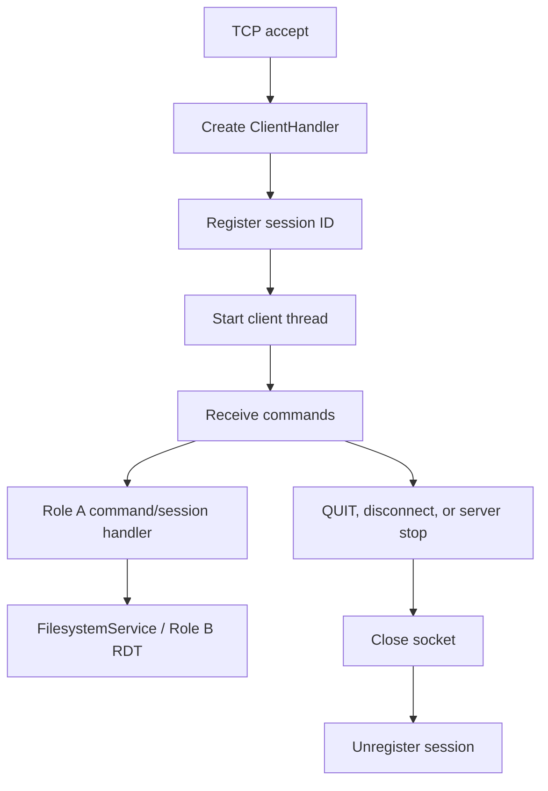
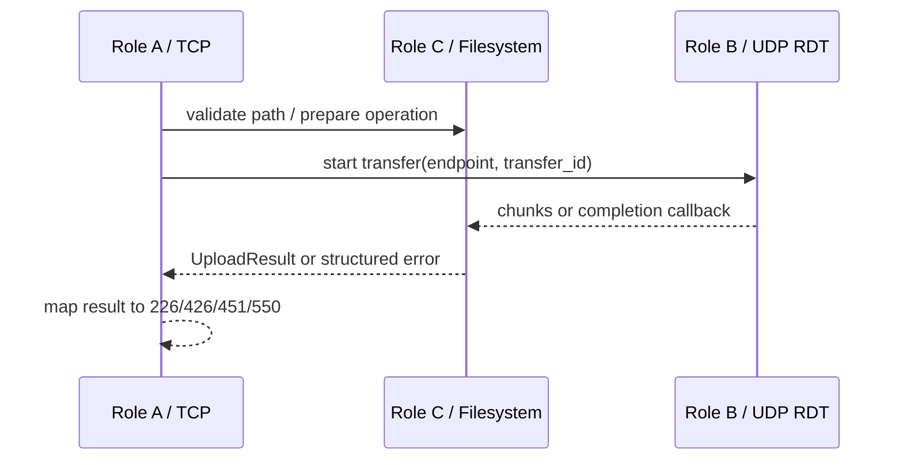

# Role C — Week 2 Integration Contract

## Filesystem API

`common.filesystem_service.FilesystemService` is the only filesystem entry point
that Roles A and B should call. Construct it once with the FTP root. Keep each
session's absolute `cwd` in Role A and pass it into every operation.

- Directory and metadata: `change_directory`, `parent_directory`, `list`,
  `names`, `stat`, `size`, `modified_time`, `make_directory`,
  `remove_directory`, `delete`, `rename`, and `hash`.
- Download: call `prepare_retrieve` or `read_chunks`, then give the validated
  path/chunks to Role B.
- Upload: pass Role B's received chunks to `store`, `store_unique`, or `append`.
  Pass the transfer's `threading.Event` as `cancel_event` so `ABOR` stops the
  write and removes the temporary file.
- Catch `FilesystemOperationError`. Its `reply_code` is ready for Role A:
  `501` for invalid parameters, `550` for unavailable/unsafe paths, `451` for a
  local filesystem failure, and `426` for a cancelled transfer.

## Thread Dispatch and Cleanup

`FTPServer.stop()` snapshots clients while holding the registry lock, releases
the lock, then closes and joins handlers. This order prevents deadlock because a
handler unregisters itself during cleanup.

## Locking and File Lifecycle

Locks are per resolved path, so unrelated transfers remain concurrent. `STOR`
and `APPE` write a hidden `.part` file and use `os.replace` only after all chunks
arrive. A failure or cancellation deletes `.part` and preserves the old target.
`APPE` holds one path lock while copying the old file and adding new chunks, so
two clients cannot interleave bytes. `STOU` selects a UUID-based unused name
while holding the directory lock.

Never hold the server's global client lock while waiting for a UDP ACK.

## TCP–UDP–Filesystem Handoff

Active/PASV endpoint negotiation remains owned by Role A/B. Role C receives the
selected endpoint through their agreed transfer API and must not open a second
TCP data connection.
